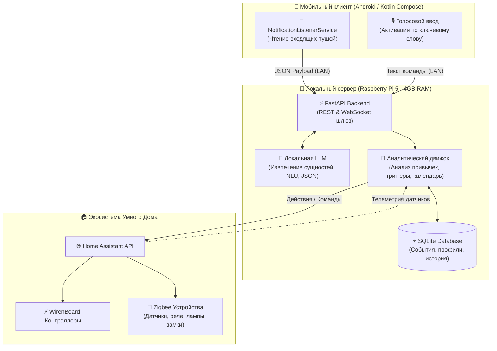

<div align="center">

```
  ____  _               _        _    ___ 
 / ___|| |__   __ _  __| | ___  / \  |_ _|
 \___ \| '_ \ / _` |/ _` |/ _ \/ _ \  | | 
  ___) | | | | (_| | (_| |  __/ ___ \ | | 
 |____/|_| |_|\__,_|\__,_|\___/_/   \_\___|
```

### 🧠 Автономная локальная AI-система для умного дома нового поколения

**100% Приватность • Никаких облаков • Локальная LLM на Raspberry Pi 5**

---

[](https://www.python.org/)
[](https://fastapi.tiangolo.com/)
[](https://developer.android.com/jetpack/compose)
[-C51A4A?style=for-the-badge&logo=raspberrypi&logoColor=white)](https://www.raspberrypi.com/)
[](https://www.home-assistant.io/)
[](https://www.sqlite.org/)
[](LICENSE)
[](#приватность-превыше-всего)

[О проекте](#-о-проекте) •
[Архитектура](#-архитектура-и-принцип-работы) •
[Фичи MVP](#-фичи-mvp) •
[Стек технологий](#-стек-технологий) •
[Цветовая палитра](#-фирменный-стиль-и-палитра) •
[Установка](#-быстрый-старт-установка) •
[Контакты](#-автор-и-создатель)

</div>

---

## 📖 О проекте

**Shade AI** — это персональный интеллектуальный ассистент и мозг умного дома, развернутый полностью локально на базе **Raspberry Pi 5 (4GB RAM)**. 

В отличие от традиционных голосовых колонок и коммерческих систем умного дома, отправляющих голосовые записи, переписки и личные уведомления на сторонние облачные сервера (Big Tech), **Shade AI хранит и обрабатывает 100% данных внутри вашего домашнего периметра**.

Проект разрабатывается как независимое соло-решение с открытым исходным кодом.
- **Основатель и разработчик:** Кузмичев Кирилл (15 лет).
- **Философия:** «Мой дом — мои данные. Искусственный интеллект должен служить человеку, сохраняя абсолютную приватность».

---

## 🛡 Приватность превыше всего

> [!IMPORTANT]
> **Zero-Cloud Architecture:** Ни один байт текста, звука, геопозиции или уведомлений не покидает пределы локальной сети. 
> Модели искусственного интеллекта квантованы и оптимизированы для выполнения прямо на CPU/RAM микрокомпьютера Raspberry Pi 5.

---

## ⚡ Фичи MVP

| # | Функция | Описание |
|---|---------|----------|
| 1 | 💡 **Управление через Home Assistant API** | Полный контроль над освещением, климатом, переключателями, замками и Zigbee/WirenBoard сценариями. |
| 2 | ⏰ **Умные уведомления и напоминания** | Контекстные напоминания с учетом текущего статуса пользователя и состояния дома. |
| 3 | 📅 **Интеграция с календарём** | Своевременная синхронизация расписания: автоматическая подготовка дома к рабочим звонкам, событиям и отдыху. |
| 4 | 📊 **Анализ привычек пользователя** | Аналитический алгоритм непрерывно изучает паттерны поведения (время подъема, возвращения, циклы сна, рутинные действия). |
| 5 | 🏡 **Проактивная автоматизация** | Дом сам подсказывает нужные действия: например, при возвращении домой система предложит подходящий сценарий освещения и температуру. |
| 6 | 📱 **Интеллектуальная обработка уведомлений** | Android-ассистент перехватывает пуши со смартфона и прогоняет через локальную LLM. <br>*Пример:* СМС «Курьер прибудет с доставкой в 16:00» $\rightarrow$ Shade AI генерирует временный PIN-код для умного замка и отправляет подтверждение. |

---

## 🧩 Архитектура и принцип работы

Shade AI связывает мобильное клиентское приложение, локальный вычислительный хаб и экосистему умного дома в единую замкнутую сеть:



### Как происходит обработка события:
1. **Сбор контекста:** Android-приложение в фоновом режиме читает системные уведомления (SMS, мессенджеры, приложения доставки) либо активирует запись микрофона по ключевому слову.
2. **Передача на хаб:** Данные шифруются и отправляются по локальному Wi-Fi на сервер FastAPI (Raspberry Pi 5).
3. **Локальный NLU (LLM):** Квантованная легковесная LLM парсит текст, определяет намерение (Intent) и структурирует сущности в строгий JSON-формат.
4. **Анализ и принятие решений:** Аналитический алгоритм сверяется с базой данных SQLite (привычки, контекст, календарь) и принимает решение о триггере действия.
5. **Исполнение:** Через Home Assistant REST API отправляется управляющий сигнал на физические устройства (WirenBoard, Zigbee реле, диммеры, смарт-замки).

---

## 🛠 Стек технологий

| Уровень | Технологии | Назначение |
|---------|-----------|------------|
| **Backend** |   | Высокопроизводительный асинхронный сервер API, маршрутизация и оркестрация |
| **Database** |  | Локальное надежное хранилище привычек, логов, расписаний и состояний |
| **AI / Edge LLM** | -FF2E00?style=flat-square) | Квантованная модель (оптимизирована под 4GB RAM Raspberry Pi 5) для NLU и структурирования |
| **Mobile Client** |   | Нативное Android-приложение: чтение пушей (`NotificationListener`), распознавание ключевого слова |
| **Smart Home** |  | Шлюз интеграции с контроллерами, датчиками, климатом и освещением |
| **Hardware** |   | Автономный микрокомпьютер RPi 5 (4GB), контроллеры автоматизации WirenBoard, сеть Zigbee |

---

## 🎨 Фирменный стиль и палитра

Визуальный язык Shade AI вдохновлен теплом домашнего очага, современным технологическим минимализмом и контрастом ночных/дневных интерфейсов.

| Образец | HEX | Название | Описание и роль в интерфейсе |
|:---:|:---:|:---:|:---|
|  | `#423E3B` | **Charcoal Brown** | Глубокий базовый тон, темная тема, надежность и стабильность ядра системы |
|  | `#FF2E00` | **Scarlet Fire** | Энергичный алый акцент, активные триггеры, критические события и пуши |
|  | `#FEA82F` | **Orange Warmth** | Теплый янтарный тон, умные напоминания, расписание и световые сценарии |
|  | `#FFFECB` | **Cream Light** | Мягкий светлый оттенок, комфортный фон карточек и фокусный контраст |

---

## 🚀 Быстрый старт (Установка)

> [!NOTE]
> Репозиторий находится в активной стадии разработки MVP. Ниже приведена инструкция по развертыванию базового каркаса.

### 1. Клонирование репозитория
```bash
git clone https://github.com/kirillkuz1122/ShadeAI.git
cd ShadeAI
```

### 2. Настройка бэкенда (Raspberry Pi 5 / Linux)
```bash
# Создание виртуального окружения
python3 -m venv venv
source venv/bin/activate

# Установка зависимостей
pip install -r requirements.txt

# Настройка переменных окружения
cp .env.example .env
nano .env  # Укажите адрес и токен Home Assistant
```

### 3. Запуск сервера Shade AI
```bash
uvicorn app.main:app --host 0.0.0.0 --port 8000 --reload
```

### 4. Клиентское приложение (Android)
1. Откройте директорию `android/` в **Android Studio Ladybug / Koala**.
2. Соберите и установите APK на устройство с Android 10+.
3. Предоставьте приложению разрешение на доступ к чтению уведомлений (**Notification Access**) и микрофону.
4. В настройках укажите локальный IP-адрес вашего Raspberry Pi 5.

---

## 🗺 Дорожная карта (Roadmap)

- [x] Проектирование архитектуры и прототипа взаимодействия с Home Assistant API
- [x] Разработка каркаса Android-клиента на Jetpack Compose с чтением уведомлений
- [ ] Оптимизация инференса локальной квантованной LLM под 4GB RAM на RPi 5
- [ ] Реализация движка анализа привычек и временных паттернов
- [ ] Поддержка двустороннего голосового общения (TTS + STT offline)
- [ ] Интеграция с локальными календарями (CalDAV / Nextcloud)
- [ ] Поддержка многокомнатного аудио и присутствия через BLE маячки

---

## 👤 Автор и создатель

Проект разрабатывается и поддерживается:

* **Кузмичев Кирилл** (15 лет)
* **Роль:** Архитектор, AI/Backend и Mobile разработчик (Соло-проект)
* **GitHub:** [@kirillkuz1122](https://github.com/kirillkuz1122)

---

## 📄 Лицензия

Проект распространяется под свободной лицензией **[MIT](LICENSE)**. 

Вы можете свободно использовать, модифицировать и внедрять наработки Shade AI в собственные проекты домашней автоматизации с сохранением авторства.
