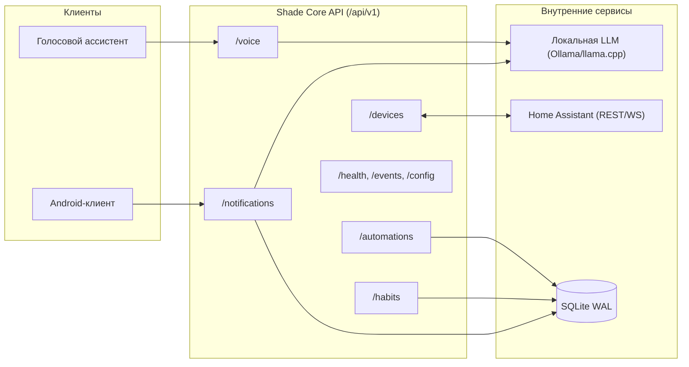

# Спецификация REST API: Shade Core

Данный документ содержит полную спецификацию программного интерфейса (REST API) серверного ядра **Shade Core** — бэкенда экосистемы **Shade AI**, развернутого на микрокомпьютере Raspberry Pi 5.

---

## 1. Общие сведения

- **Базовый URL:** `http://<raspberry-pi-ip>:8000/api/v1`
- **Протокол:** HTTP/1.1 (с поддержкой перехода на HTTP/2 и WebSocket в рамках расширений)
- **Формат данных:** `application/json; charset=utf-8` (за исключением эндпоинтов загрузки бинарных медиафайлов, использующих `multipart/form-data`)
- **Формат даты и времени:** Строка в стандарте ISO 8601 UTC (например, `2026-09-17T06:15:30Z`)
- **Интерактивная документация:** Доступна при запущенном сервисе по адресам `/docs` (Swagger UI) и `/redoc` (ReDoc).

---

## 2. Аутентификация и безопасность

Все запросы к защищенным эндпоинтам API должны содержать заголовок HTTP `Authorization` с Bearer-токеном (API Key):

```http
Authorization: Bearer <SHADE_API_KEY>
```

> [!NOTE]
> **Генерация API-ключа:** Мастер-ключ (`SHADE_API_KEY`) генерируется автоматически при первом запуске Shade Core через CLI/systemd и сохраняется в защищенном локальном файле конфигурации (`.env` / `config.yaml` с правами доступа `chmod 600`). Данный ключ указывается в настройках Android-клиента при сопряжении с сервером.

### Коды ошибок аутентификации

| Код | Описание | Причина |
| :--- | :--- | :--- |
| `401 Unauthorized` | Токен отсутствует или недействителен | Заголовок `Authorization` не передан или передан неверный токен |
| `403 Forbidden` | Доступ запрещен | Ключ заблокирован или не обладает требуемыми привилегиями |

---

## 3. Стандартный формат ошибок

В случае возникновения клиентской (`4xx`) или серверной (`5xx`) ошибки Shade Core возвращает структурированный JSON-ответ:

```json
{
  "error": {
    "code": "RESOURCE_NOT_FOUND",
    "message": "Уведомление с ID 'ntf_982341' не найдено",
    "details": {
      "id": "ntf_982341"
    },
    "timestamp": "2026-09-17T06:15:30Z"
  }
}
```

---

## 4. Эндпоинты API



---

### 4.1. Уведомления (Notifications)

Модуль предназначен для приема перехваченных push-уведомлений с Android-смартфона пользователя (через системный `NotificationListenerService`), их сохранения и интеллектуального анализа локальной LLM.

#### 4.1.1. `POST /notifications` — Отправить уведомление

Принимает сырое уведомление из мобильного приложения, инициирует фоновый разбор сущностей локальной LLM и сохраняет результат в базу данных.

##### Заголовки (Headers)
| Заголовок | Тип | Обязательный | Описание |
| :--- | :--- | :--- | :--- |
| `Authorization` | `string` | Да | `Bearer <SHADE_API_KEY>` |
| `Content-Type` | `string` | Да | `application/json` |

##### Тело запроса (Request Body)
| Поле | Тип | Обязательное | Описание |
| :--- | :--- | :--- | :--- |
| `app_name` | `string` | Да | Имя пакета приложения (например, `ru.yandex.taxi`, `com.sberbank.mobile`) |
| `title` | `string` | Да | Заголовок уведомления |
| `text` | `string` | Да | Основной текст уведомления |
| `timestamp` | `string` | Да | Время генерации уведомления на устройстве (ISO 8601 UTC) |
| `priority` | `string` | Нет | Приоритет Android: `low`, `default`, `high`, `max` (по умолчанию `default`) |

##### Поля успешного ответа (201 Created)
| Поле | Тип | Описание |
| :--- | :--- | :--- |
| `id` | `string` | Уникальный идентификатор сохраненного уведомления в базе |
| `status` | `string` | Статус обработки: `queued`, `processed`, `skipped` |
| `processed_data` | `object` | Результат экстракции данных локальной LLM (категория, сущности, намерение) |

##### Пример cURL-запроса
```bash
curl -X POST "http://<raspberry-pi-ip>:8000/api/v1/notifications" \
  -H "Authorization: Bearer <SHADE_API_KEY>" \
  -H "Content-Type: application/json" \
  -d '{
    "app_name": "ru.ozon.app.android",
    "title": "Ozon Доставка",
    "text": "Курьер прибудет сегодня с 18:00 до 20:00. Код получения: 4812",
    "timestamp": "2026-09-17T11:00:00Z",
    "priority": "high"
  }'
```

##### Пример ответа (HTTP 201)
```json
{
  "id": "ntf_7a1b8c9d0e",
  "status": "processed",
  "processed_data": {
    "category": "delivery",
    "delivery_service": "Ozon",
    "time_window": {
      "start": "2026-09-17T18:00:00Z",
      "end": "2026-09-17T20:00:00Z"
    },
    "verification_code": "4812",
    "action_required": false,
    "confidence": 0.96
  }
}
```

---

#### 4.1.2. `GET /notifications` — Получить историю уведомлений

Возвращает список сохраненных уведомлений с возможностью фильтрации по категории и постраничной навигации.

##### Заголовки (Headers)
| Заголовок | Тип | Обязательный | Описание |
| :--- | :--- | :--- | :--- |
| `Authorization` | `string` | Да | `Bearer <SHADE_API_KEY>` |

##### Query-параметры
| Параметр | Тип | По умолчанию | Описание |
| :--- | :--- | :--- | :--- |
| `limit` | `integer` | `50` | Максимальное число записей в ответе (1..200) |
| `offset` | `integer` | `0` | Смещение относительно начала выборки |
| `category` | `string` | `null` | Фильтр по категории (например, `delivery`, `banking`, `messenger`, `smart_home`) |

##### Поля успешного ответа (200 OK)
| Поле | Тип | Описание |
| :--- | :--- | :--- |
| `items` | `array` | Массив объектов уведомлений |
| `items[].id` | `string` | Уникальный ID уведомления |
| `items[].app_name`| `string` | Пакет приложения |
| `items[].title` | `string` | Заголовок |
| `items[].text` | `string` | Текст |
| `items[].category` | `string` | Распознанная категория |
| `items[].timestamp` | `string` | Время получения (ISO 8601) |
| `items[].processed_data` | `object` | Извлеченные сущности |
| `total` | `integer` | Общее число уведомлений, удовлетворяющих фильтру |

##### Пример cURL-запроса
```bash
curl -X GET "http://<raspberry-pi-ip>:8000/api/v1/notifications?limit=50&offset=0&category=delivery" \
  -H "Authorization: Bearer <SHADE_API_KEY>"
```

##### Пример ответа (HTTP 200)
```json
{
  "items": [
    {
      "id": "ntf_7a1b8c9d0e",
      "app_name": "ru.ozon.app.android",
      "title": "Ozon Доставка",
      "text": "Курьер прибудет сегодня с 18:00 до 20:00. Код получения: 4812",
      "category": "delivery",
      "timestamp": "2026-09-17T11:00:00Z",
      "processed_data": {
        "delivery_service": "Ozon",
        "verification_code": "4812"
      }
    }
  ],
  "total": 1
}
```

---

#### 4.1.3. `GET /notifications/{id}` — Получить конкретное уведомление

Возвращает детальную информацию о конкретном уведомлении по его идентификатору.

##### Заголовки (Headers)
| Заголовок | Тип | Обязательный | Описание |
| :--- | :--- | :--- | :--- |
| `Authorization` | `string` | Да | `Bearer <SHADE_API_KEY>` |

##### Path-параметры
| Параметр | Тип | Описание |
| :--- | :--- | :--- |
| `id` | `string` | Идентификатор уведомления (например, `ntf_7a1b8c9d0e`) |

##### Поля успешного ответа (200 OK)
| Поле | Тип | Описание |
| :--- | :--- | :--- |
| `id` | `string` | Уникальный ID уведомления |
| `app_name` | `string` | Имя приложения |
| `title` | `string` | Заголовок |
| `text` | `string` | Полный текст |
| `timestamp` | `string` | Время отправки |
| `priority` | `string` | Приоритет Android |
| `status` | `string` | Текущий статус обработки (`processed`, `archived`) |
| `category` | `string` | Классифицированная категория |
| `processed_data` | `object` | Структурированные сущности, выделенные LLM |
| `created_at` | `string` | Время записи на сервере |

##### Пример cURL-запроса
```bash
curl -X GET "http://<raspberry-pi-ip>:8000/api/v1/notifications/ntf_7a1b8c9d0e" \
  -H "Authorization: Bearer <SHADE_API_KEY>"
```

##### Пример ответа (HTTP 200)
```json
{
  "id": "ntf_7a1b8c9d0e",
  "app_name": "ru.ozon.app.android",
  "title": "Ozon Доставка",
  "text": "Курьер прибудет сегодня с 18:00 до 20:00. Код получения: 4812",
  "timestamp": "2026-09-17T11:00:00Z",
  "priority": "high",
  "status": "processed",
  "category": "delivery",
  "processed_data": {
    "delivery_service": "Ozon",
    "time_window": {
      "start": "2026-09-17T18:00:00Z",
      "end": "2026-09-17T20:00:00Z"
    },
    "verification_code": "4812"
  },
  "created_at": "2026-09-17T11:00:01Z"
}
```

---

### 4.2. Устройства умного дома (Devices & Home Assistant)

Предоставляет интерфейс проксирования и абстракции над устройствами, подключенными к локальному инстансу Home Assistant (Zigbee, Z-Wave, WirenBoard RS-485, Wi-Fi).

#### 4.2.1. `GET /devices` — Список устройств из Home Assistant

Опрашивает локальный Home Assistant и возвращает нормализованный список устройств и их состояний.

##### Заголовки (Headers)
| Заголовок | Тип | Обязательный | Описание |
| :--- | :--- | :--- | :--- |
| `Authorization` | `string` | Да | `Bearer <SHADE_API_KEY>` |

##### Query-параметры
| Параметр | Тип | По умолчанию | Описание |
| :--- | :--- | :--- | :--- |
| `domain` | `string` | `null` | Фильтр по домену (например, `light`, `switch`, `climate`, `sensor`) |

##### Поля успешного ответа (200 OK)
| Поле | Тип | Описание |
| :--- | :--- | :--- |
| `devices` | `array` | Список подключенных устройств |
| `devices[].entity_id` | `string` | Идентификатор сущности в HA (например, `light.living_room`) |
| `devices[].name` | `string` | Человекочитаемое имя устройства |
| `devices[].state` | `string` | Текущее состояние (`on`, `off`, `open`, `closed`, числовое значение) |
| `devices[].type` | `string` | Категория устройства (`light`, `switch`, `climate`, `cover`, `sensor`) |
| `devices[].attributes` | `object` | Дополнительные атрибуты (яркость, температура, единицы измерения) |

##### Пример cURL-запроса
```bash
curl -X GET "http://<raspberry-pi-ip>:8000/api/v1/devices" \
  -H "Authorization: Bearer <SHADE_API_KEY>"
```

##### Пример ответа (HTTP 200)
```json
{
  "devices": [
    {
      "entity_id": "light.living_room_ceiling",
      "name": "Основной свет в гостиной",
      "state": "on",
      "type": "light",
      "attributes": {
        "brightness": 204,
        "color_temp": 3000
      }
    },
    {
      "entity_id": "switch.wb_relay_corridor",
      "name": "Реле теплого пола (WirenBoard)",
      "state": "off",
      "type": "switch",
      "attributes": {}
    },
    {
      "entity_id": "sensor.bedroom_temperature",
      "name": "Датчик температуры в спальне",
      "state": "22.4",
      "type": "sensor",
      "attributes": {
        "unit_of_measurement": "°C"
      }
    }
  ]
}
```

---

#### 4.2.2. `POST /devices/{entity_id}/command` — Отправить команду устройству

Выполняет управляющее действие над физическим устройством через Home Assistant.

##### Заголовки (Headers)
| Заголовок | Тип | Обязательный | Описание |
| :--- | :--- | :--- | :--- |
| `Authorization` | `string` | Да | `Bearer <SHADE_API_KEY>` |
| `Content-Type` | `string` | Да | `application/json` |

##### Path-параметры
| Параметр | Тип | Описание |
| :--- | :--- | :--- |
| `entity_id` | `string` | Идентификатор устройства в Home Assistant (например, `light.living_room_ceiling`) |

##### Тело запроса (Request Body)
| Поле | Тип | Обязательное | Описание |
| :--- | :--- | :--- | :--- |
| `action` | `string` | Да | Действие: `"turn_on"`, `"turn_off"`, `"toggle"`, `"set_temperature"` и др. |
| `params` | `object` | Нет | Словарь дополнительных параметров команды (например, `{"brightness": 128}`) |

##### Поля успешного ответа (200 OK)
| Поле | Тип | Описание |
| :--- | :--- | :--- |
| `status` | `string` | Результат выполнения (`success`, `error`) |
| `entity_id` | `string` | Идентификатор устройства |
| `new_state` | `string` | Новое состояние устройства после выполнения команды |
| `executed_at` | `string` | Время выполнения (ISO 8601) |

##### Пример cURL-запроса
```bash
curl -X POST "http://<raspberry-pi-ip>:8000/api/v1/devices/light.living_room_ceiling/command" \
  -H "Authorization: Bearer <SHADE_API_KEY>" \
  -H "Content-Type: application/json" \
  -d '{
    "action": "turn_on",
    "params": {
      "brightness": 180,
      "transition": 1
    }
  }'
```

##### Пример ответа (HTTP 200)
```json
{
  "status": "success",
  "entity_id": "light.living_room_ceiling",
  "new_state": "on",
  "executed_at": "2026-09-17T11:05:22Z"
}
```

---

#### 4.2.3. `GET /devices/{entity_id}/state` — Получить состояние устройства

Возвращает актуальное текущее состояние и все расширенные атрибуты конкретного устройства.

##### Заголовки (Headers)
| Заголовок | Тип | Обязательный | Описание |
| :--- | :--- | :--- | :--- |
| `Authorization` | `string` | Да | `Bearer <SHADE_API_KEY>` |

##### Path-параметры
| Параметр | Тип | Описание |
| :--- | :--- | :--- |
| `entity_id` | `string` | Идентификатор сущности в Home Assistant |

##### Поля успешного ответа (200 OK)
| Поле | Тип | Описание |
| :--- | :--- | :--- |
| `entity_id` | `string` | Идентификатор устройства |
| `name` | `string` | Дружелюбное имя устройства |
| `state` | `string` | Текущее значение состояния (`on`, `off`, `unavailable`, число) |
| `type` | `string` | Домен устройства |
| `last_changed` | `string` | Время последнего изменения состояния |
| `last_updated` | `string` | Время последнего подтверждения телеметрии |
| `attributes` | `object` | Полная карта атрибутов Home Assistant |

##### Пример cURL-запроса
```bash
curl -X GET "http://<raspberry-pi-ip>:8000/api/v1/devices/light.living_room_ceiling/state" \
  -H "Authorization: Bearer <SHADE_API_KEY>"
```

##### Пример ответа (HTTP 200)
```json
{
  "entity_id": "light.living_room_ceiling",
  "name": "Основной свет в гостиной",
  "state": "on",
  "type": "light",
  "last_changed": "2026-09-17T11:05:22Z",
  "last_updated": "2026-09-17T11:05:22Z",
  "attributes": {
    "brightness": 180,
    "friendly_name": "Основной свет в гостиной",
    "supported_color_modes": ["brightness", "color_temp"]
  }
}
```

---

### 4.3. Привычки и поведенческие паттерны (Habits)

Эндпоинты аналитического движка Shade AI, агрегирующего регулярные действия пользователя для автоматического формирования рекомендаций и умных сценариев.

#### 4.3.1. `GET /habits` — Список обнаруженных привычек

Возвращает список поведенческих закономерностей, выявленных алгоритмами Shade AI на основе истории событий.

##### Заголовки (Headers)
| Заголовок | Тип | Обязательный | Описание |
| :--- | :--- | :--- | :--- |
| `Authorization` | `string` | Да | `Bearer <SHADE_API_KEY>` |

##### Query-параметры
| Параметр | Тип | По умолчанию | Описание |
| :--- | :--- | :--- | :--- |
| `min_confidence` | `float` | `0.5` | Минимальный уровень уверенности алгоритма (0.0 .. 1.0) |

##### Поля успешного ответа (200 OK)
| Поле | Тип | Описание |
| :--- | :--- | :--- |
| `habits` | `array` | Массив обнаруженных привычек |
| `habits[].id` | `string` | Уникальный идентификатор привычки |
| `habits[].description` | `string` | Человекочитаемое описание привычки на русском языке |
| `habits[].confidence` | `float` | Уверенность алгоритма в устойчивости паттерна (от 0.0 до 1.0) |
| `habits[].pattern` | `object` | Структура условий и триггеров повторяемости паттерна |
| `habits[].last_seen` | `string` | Время последнего совпадения условий паттерна (ISO 8601) |

##### Пример cURL-запроса
```bash
curl -X GET "http://<raspberry-pi-ip>:8000/api/v1/habits" \
  -H "Authorization: Bearer <SHADE_API_KEY>"
```

##### Пример ответа (HTTP 200)
```json
{
  "habits": [
    {
      "id": "hbt_89ab12cd",
      "description": "Включение ночника в коридоре при движении после 23:30",
      "confidence": 0.89,
      "pattern": {
        "days": ["mon", "tue", "wed", "thu", "fri", "sat", "sun"],
        "time_window": "23:30-05:00",
        "trigger": "binary_sensor.corridor_motion",
        "action": "light.turn_on",
        "target": "light.corridor_nightlight"
      },
      "last_seen": "2026-09-17T00:14:10Z"
    },
    {
      "id": "hbt_34ef56gh",
      "description": "Выключение кондиционера при открытии окна более чем на 5 минут",
      "confidence": 0.94,
      "pattern": {
        "trigger": "binary_sensor.window_bedroom",
        "delay_minutes": 5,
        "action": "climate.turn_off",
        "target": "climate.bedroom_ac"
      },
      "last_seen": "2026-09-16T19:42:00Z"
    }
  ]
}
```

---

### 4.4. Автоматизации (Automations)

Управление сценариями локальной автоматизации Shade AI: создание, просмотр, обновление и удаление правил реагирования на события.

#### 4.4.1. `GET /automations` — Список автоматизаций

Возвращает список всех зарегистрированных автоматизаций.

##### Заголовки (Headers)
| Заголовок | Тип | Обязательный | Описание |
| :--- | :--- | :--- | :--- |
| `Authorization` | `string` | Да | `Bearer <SHADE_API_KEY>` |

##### Query-параметры
| Параметр | Тип | По умолчанию | Описание |
| :--- | :--- | :--- | :--- |
| `enabled` | `boolean` | `null` | Фильтр по статусу активности (`true` или `false`) |

##### Поля успешного ответа (200 OK)
| Поле | Тип | Описание |
| :--- | :--- | :--- |
| `automations` | `array` | Массив объектов автоматизаций |
| `automations[].id` | `string` | Идентификатор автоматизации |
| `automations[].name` | `string` | Название сценария |
| `automations[].trigger` | `object` | Событие-триггер (устройство, время, входящее уведомление) |
| `automations[].condition` | `object` | Дополнительные условия срабатывания |
| `automations[].action` | `object` | Выполняемое действие (вызов сервиса, отправка пуша) |
| `automations[].enabled` | `boolean` | Флаг активности сценария |
| `automations[].created_at` | `string` | Дата создания |
| `automations[].updated_at` | `string` | Дата обновления |

##### Пример cURL-запроса
```bash
curl -X GET "http://<raspberry-pi-ip>:8000/api/v1/automations" \
  -H "Authorization: Bearer <SHADE_API_KEY>"
```

##### Пример ответа (HTTP 200)
```json
{
  "automations": [
    {
      "id": "aut_4f92a11b",
      "name": "Встреча курьера",
      "trigger": {
        "type": "notification",
        "category": "delivery",
        "keywords": ["курьер", "код"]
      },
      "condition": {
        "type": "time_range",
        "after": "10:00",
        "before": "22:00"
      },
      "action": {
        "type": "device_command",
        "entity_id": "light.hallway_entry",
        "command": "turn_on",
        "params": { "brightness": 255 }
      },
      "enabled": true,
      "created_at": "2026-09-10T14:20:00Z",
      "updated_at": "2026-09-15T09:12:00Z"
    }
  ]
}
```

---

#### 4.4.2. `POST /automations` — Создать автоматизацию

Регистрирует новый сценарий автоматизации.

##### Заголовки (Headers)
| Заголовок | Тип | Обязательный | Описание |
| :--- | :--- | :--- | :--- |
| `Authorization` | `string` | Да | `Bearer <SHADE_API_KEY>` |
| `Content-Type` | `string` | Да | `application/json` |

##### Тело запроса (Request Body)
| Поле | Тип | Обязательное | Описание |
| :--- | :--- | :--- | :--- |
| `name` | `string` | Нет | Название сценария |
| `trigger` | `object` | Да | Описание триггера (тип, источник, параметры) |
| `condition` | `object` | Нет | Условия проверки перед выполнением (может быть пустым `{}`) |
| `action` | `object` | Да | Исполняемое действие |
| `enabled` | `boolean` | Нет | Флаг активности (по умолчанию `true`) |

##### Поля успешного ответа (201 Created)
| Поле | Тип | Описание |
| :--- | :--- | :--- |
| `id` | `string` | Назначенный идентификатор созданной автоматизации |
| `name` | `string` | Название сценария |
| `trigger` | `object` | Сохраненная конфигурация триггера |
| `condition` | `object` | Сохраненная конфигурация условий |
| `action` | `object` | Сохраненная конфигурация действия |
| `enabled` | `boolean` | Текущий статус |
| `created_at` | `string` | Время создания (ISO 8601) |

##### Пример cURL-запроса
```bash
curl -X POST "http://<raspberry-pi-ip>:8000/api/v1/automations" \
  -H "Authorization: Bearer <SHADE_API_KEY>" \
  -H "Content-Type: application/json" \
  -d '{
    "name": "Ночной режим света",
    "trigger": {
      "type": "time",
      "at": "23:00"
    },
    "condition": {
      "type": "device_state",
      "entity_id": "binary_sensor.someone_at_home",
      "state": "on"
    },
    "action": {
      "type": "device_command",
      "entity_id": "light.living_room_ceiling",
      "command": "turn_off",
      "params": {}
    },
    "enabled": true
  }'
```

##### Пример ответа (HTTP 201)
```json
{
  "id": "aut_78c2e99a",
  "name": "Ночной режим света",
  "trigger": {
    "type": "time",
    "at": "23:00"
  },
  "condition": {
    "type": "device_state",
    "entity_id": "binary_sensor.someone_at_home",
    "state": "on"
  },
  "action": {
    "type": "device_command",
    "entity_id": "light.living_room_ceiling",
    "command": "turn_off",
    "params": {}
  },
  "enabled": true,
  "created_at": "2026-09-17T11:10:00Z"
}
```

---

#### 4.4.3. `PUT /automations/{id}` — Обновить автоматизацию

Выполняет обновление параметров существующей автоматизации.

##### Заголовки (Headers)
| Заголовок | Тип | Обязательный | Описание |
| :--- | :--- | :--- | :--- |
| `Authorization` | `string` | Да | `Bearer <SHADE_API_KEY>` |
| `Content-Type` | `string` | Да | `application/json` |

##### Path-параметры
| Параметр | Тип | Описание |
| :--- | :--- | :--- |
| `id` | `string` | Идентификатор автоматизации |

##### Тело запроса (Request Body)
| Поле | Тип | Обязательное | Описание |
| :--- | :--- | :--- | :--- |
| `name` | `string` | Нет | Новое имя сценария |
| `trigger` | `object` | Нет | Обновленный триггер |
| `condition` | `object` | Нет | Обновленные условия |
| `action` | `object` | Нет | Обновленное действие |
| `enabled` | `boolean` | Нет | Включение / отключение правила |

##### Поля успешного ответа (200 OK)
| Поле | Тип | Описание |
| :--- | :--- | :--- |
| `id` | `string` | Идентификатор автоматизации |
| `name` | `string` | Обновленное имя |
| `trigger` | `object` | Актуальный триггер |
| `condition` | `object` | Актуальные условия |
| `action` | `object` | Актуальное действие |
| `enabled` | `boolean` | Актуальный статус |
| `updated_at` | `string` | Время обновления (ISO 8601) |

##### Пример cURL-запроса
```bash
curl -X PUT "http://<raspberry-pi-ip>:8000/api/v1/automations/aut_78c2e99a" \
  -H "Authorization: Bearer <SHADE_API_KEY>" \
  -H "Content-Type: application/json" \
  -d '{
    "enabled": false
  }'
```

##### Пример ответа (HTTP 200)
```json
{
  "id": "aut_78c2e99a",
  "name": "Ночной режим света",
  "trigger": {
    "type": "time",
    "at": "23:00"
  },
  "condition": {
    "type": "device_state",
    "entity_id": "binary_sensor.someone_at_home",
    "state": "on"
  },
  "action": {
    "type": "device_command",
    "entity_id": "light.living_room_ceiling",
    "command": "turn_off",
    "params": {}
  },
  "enabled": false,
  "updated_at": "2026-09-17T11:15:45Z"
}
```

---

#### 4.4.4. `DELETE /automations/{id}` — Удалить автоматизацию

Удаляет сценарий автоматизации по указанному ID.

##### Заголовки (Headers)
| Заголовок | Тип | Обязательный | Описание |
| :--- | :--- | :--- | :--- |
| `Authorization` | `string` | Да | `Bearer <SHADE_API_KEY>` |

##### Path-параметры
| Параметр | Тип | Описание |
| :--- | :--- | :--- |
| `id` | `string` | Идентификатор удаляемой автоматизации |

##### Поля успешного ответа (200 OK или 204 No Content)
| Поле | Тип | Описание |
| :--- | :--- | :--- |
| `status` | `string` | Статус операции (`deleted`) |
| `id` | `string` | Идентификатор удаленного сценария |

##### Пример cURL-запроса
```bash
curl -X DELETE "http://<raspberry-pi-ip>:8000/api/v1/automations/aut_78c2e99a" \
  -H "Authorization: Bearer <SHADE_API_KEY>"
```

##### Пример ответа (HTTP 200)
```json
{
  "status": "deleted",
  "id": "aut_78c2e99a"
}
```

---

### 4.5. Система и диагностика (System)

Эндпоинты контроля состояния сервера Shade Core, метрик ресурсов Raspberry Pi 5, журнала событий и конфигурации.

#### 4.5.1. `GET /health` — Статус системы

Проверяет работоспособность ядра, подключение к Home Assistant, состояние локальной LLM и размер базы данных SQLite.

##### Заголовки (Headers)
| Заголовок | Тип | Обязательный | Описание |
| :--- | :--- | :--- | :--- |
| `Authorization` | `string` | Нет / Да | Проверка доступности может быть открытой или требовать токен в зависимости от настроек |

##### Поля успешного ответа (200 OK)
| Поле | Тип | Описание |
| :--- | :--- | :--- |
| `status` | `string` | Общий статус сервиса: `ok`, `degraded`, `error` |
| `uptime` | `integer` | Время непрерывной работы процесса в секундах |
| `ha_connected` | `boolean` | Статус соединения с локальным сервером Home Assistant |
| `llm_status` | `string` | Статус локального инференса LLM: `ready`, `busy`, `unreachable` |
| `db_size` | `string` | Размер файла базы данных SQLite (например, `"42.8 MB"`) |

##### Пример cURL-запроса
```bash
curl -X GET "http://<raspberry-pi-ip>:8000/api/v1/health" \
  -H "Authorization: Bearer <SHADE_API_KEY>"
```

##### Пример ответа (HTTP 200)
```json
{
  "status": "ok",
  "uptime": 172800,
  "ha_connected": true,
  "llm_status": "ready",
  "db_size": "42.8 MB"
}
```

---

#### 4.5.2. `GET /events` — Журнал событий

Возвращает системный аудит-лог событий (срабатывание триггеров, выполнение команд, приход уведомлений, ошибки).

##### Заголовки (Headers)
| Заголовок | Тип | Обязательный | Описание |
| :--- | :--- | :--- | :--- |
| `Authorization` | `string` | Да | `Bearer <SHADE_API_KEY>` |

##### Query-параметры
| Параметр | Тип | По умолчанию | Описание |
| :--- | :--- | :--- | :--- |
| `limit` | `integer` | `100` | Максимальное количество записей (1..500) |
| `from` | `string` | `null` | Начальная дата диапазона выборки (формат `YYYY-MM-DD` или ISO 8601) |
| `to` | `string` | `null` | Конечная дата диапазона выборки (формат `YYYY-MM-DD` или ISO 8601) |

##### Поля успешного ответа (200 OK)
| Поле | Тип | Описание |
| :--- | :--- | :--- |
| `events` | `array` | Список событий |
| `events[].id` | `string` | Уникальный ID события |
| `events[].timestamp` | `string` | Время фиксации события |
| `events[].source` | `string` | Источник события (`android`, `home_assistant`, `automation_engine`, `system`) |
| `events[].type` | `string` | Тип события (`command_executed`, `notification_received`, `rule_triggered`, `error`) |
| `events[].payload` | `object` | Дополнительные параметры и контекст события |
| `total` | `integer` | Количество событий в выборке |

##### Пример cURL-запроса
```bash
curl -X GET "http://<raspberry-pi-ip>:8000/api/v1/events?limit=100&from=2024-01-01&to=2024-12-31" \
  -H "Authorization: Bearer <SHADE_API_KEY>"
```

##### Пример ответа (HTTP 200)
```json
{
  "events": [
    {
      "id": "evt_91e0a2",
      "timestamp": "2024-11-20T18:30:15Z",
      "source": "automation_engine",
      "type": "command_executed",
      "payload": {
        "automation_id": "aut_4f92a11b",
        "entity_id": "light.hallway_entry",
        "action": "turn_on"
      }
    },
    {
      "id": "evt_91e0a3",
      "timestamp": "2024-11-20T18:30:14Z",
      "source": "android",
      "type": "notification_received",
      "payload": {
        "notification_id": "ntf_7a1b8c9d0e",
        "category": "delivery"
      }
    }
  ],
  "total": 2
}
```

---

#### 4.5.3. `GET /config` — Текущая конфигурация

Возвращает активную конфигурацию Shade Core (за исключением секретных токенов и паролей).

##### Заголовки (Headers)
| Заголовок | Тип | Обязательный | Описание |
| :--- | :--- | :--- | :--- |
| `Authorization` | `string` | Да | `Bearer <SHADE_API_KEY>` |

##### Поля успешного ответа (200 OK)
| Поле | Тип | Описание |
| :--- | :--- | :--- |
| `server` | `object` | Настройки хоста, порта и путей |
| `home_assistant` | `object` | URL подключения к Home Assistant и флаги синхронизации |
| `llm` | `object` | Название активной локальной модели, температура, контекстное окно |
| `logging` | `object` | Уровень детализации логов (`DEBUG`, `INFO`, `WARNING`) |

##### Пример cURL-запроса
```bash
curl -X GET "http://<raspberry-pi-ip>:8000/api/v1/config" \
  -H "Authorization: Bearer <SHADE_API_KEY>"
```

##### Пример ответа (HTTP 200)
```json
{
  "server": {
    "host": "0.0.0.0",
    "port": 8000,
    "environment": "production"
  },
  "home_assistant": {
    "base_url": "http://127.0.0.1:8123",
    "sync_interval_seconds": 30
  },
  "llm": {
    "engine": "ollama",
    "model": "tinyllama:1.1b-chat-v1.0-q4_K_M",
    "temperature": 0.2,
    "context_length": 2048
  },
  "logging": {
    "level": "INFO",
    "retention_days": 14
  }
}
```

---

#### 4.5.4. `PUT /config` — Обновить конфигурацию

Обновляет динамические параметры конфигурации без необходимости полного перезапуска сервиса.

##### Заголовки (Headers)
| Заголовок | Тип | Обязательный | Описание |
| :--- | :--- | :--- | :--- |
| `Authorization` | `string` | Да | `Bearer <SHADE_API_KEY>` |
| `Content-Type` | `string` | Да | `application/json` |

##### Тело запроса (Request Body)
| Поле | Тип | Обязательное | Описание |
| :--- | :--- | :--- | :--- |
| `llm` | `object` | Нет | Параметры LLM (модель, температура и т.д.) |
| `logging` | `object` | Нет | Параметры логирования |
| `home_assistant` | `object` | Нет | Параметры подключения к Home Assistant |

##### Поля успешного ответа (200 OK)
| Поле | Тип | Описание |
| :--- | :--- | :--- |
| `status` | `string` | Результат применения изменений (`applied`) |
| `updated_config`| `object` | Результирующий актуальный конфигурационный объект |

##### Пример cURL-запроса
```bash
curl -X PUT "http://<raspberry-pi-ip>:8000/api/v1/config" \
  -H "Authorization: Bearer <SHADE_API_KEY>" \
  -H "Content-Type: application/json" \
  -d '{
    "llm": {
      "model": "phi-2:2.7b-q4_K_M",
      "temperature": 0.1
    },
    "logging": {
      "level": "DEBUG"
    }
  }'
```

##### Пример ответа (HTTP 200)
```json
{
  "status": "applied",
  "updated_config": {
    "server": {
      "host": "0.0.0.0",
      "port": 8000,
      "environment": "production"
    },
    "home_assistant": {
      "base_url": "http://127.0.0.1:8123",
      "sync_interval_seconds": 30
    },
    "llm": {
      "engine": "ollama",
      "model": "phi-2:2.7b-q4_K_M",
      "temperature": 0.1,
      "context_length": 2048
    },
    "logging": {
      "level": "DEBUG",
      "retention_days": 14
    }
  }
}
```

---

### 4.6. Голосовой ввод и команды (Voice)

Прием голосовых данных со смартфона или микрофонных станций. Поддерживает два формата передачи:
1. **Бинарный аудиофайл** (`multipart/form-data`) для последующей локальной транскрибации (STT).
2. **Текстовая команда** (`application/json`), предварительно расшифрованная системным `SpeechRecognizer` на Android-устройстве.

#### 4.6.1. `POST /voice` — Отправить голосовой ввод

##### Вариант А: JSON с готовым текстом команды

###### Заголовки (Headers)
| Заголовок | Тип | Обязательный | Описание |
| :--- | :--- | :--- | :--- |
| `Authorization` | `string` | Да | `Bearer <SHADE_API_KEY>` |
| `Content-Type` | `string` | Да | `application/json` |

###### Тело запроса (Request Body)
| Поле | Тип | Обязательное | Описание |
| :--- | :--- | :--- | :--- |
| `text` | `string` | Да | Расшифрованный текст голосовой команды |

###### Пример cURL-запроса
```bash
curl -X POST "http://<raspberry-pi-ip>:8000/api/v1/voice" \
  -H "Authorization: Bearer <SHADE_API_KEY>" \
  -H "Content-Type: application/json" \
  -d '{
    "text": "Включи подсветку на кухне и сделай теплый свет"
  }'
```

---

##### Вариант Б: multipart/form-data с аудиофайлом

###### Заголовки (Headers)
| Заголовок | Тип | Обязательный | Описание |
| :--- | :--- | :--- | :--- |
| `Authorization` | `string` | Да | `Bearer <SHADE_API_KEY>` |
| `Content-Type` | `string` | Да | `multipart/form-data` |

###### Форма данных (Form Data)
| Поле | Тип | Обязательное | Описание |
| :--- | :--- | :--- | :--- |
| `audio` | `file` (binary) | Да | Аудиофайл с записью голоса (`audio/wav`, `audio/ogg`, `audio/m4a`) |
| `language` | `string` | Нет | Код языка распознавания (по умолчанию `"ru"`) |

###### Пример cURL-запроса
```bash
curl -X POST "http://<raspberry-pi-ip>:8000/api/v1/voice" \
  -H "Authorization: Bearer <SHADE_API_KEY>" \
  -F "audio=@/path/to/voice_sample.wav;type=audio/wav" \
  -F "language=ru"
```

---

##### Поля успешного ответа (200 OK)
| Поле | Тип | Описание |
| :--- | :--- | :--- |
| `transcription` | `string` | Распознанный текст голосового ввода |
| `intent` | `string` | Определенное намерение пользователя (`device_control`, `query_state`, `conversation`) |
| `action_executed` | `boolean` | Признак успешного автоматического выполнения команды |
| `execution_result` | `object` | Результат взаимодействия с исполнительным устройством |
| `response_text` | `string` | Ответный текст ассистента для озвучивания (TTS) или показа в UI |

##### Пример ответа (HTTP 200)
```json
{
  "transcription": "Включи подсветку на кухне и сделай теплый свет",
  "intent": "device_control",
  "action_executed": true,
  "execution_result": {
    "entity_id": "light.kitchen_under_cabinet",
    "state": "on",
    "color_temp": 3000
  },
  "response_text": "Подсветка на кухне включена в теплом спектре"
}
```

---

## 5. Таблица кодов ответов HTTP

| HTTP-код | Статус | Применение в Shade Core |
| :--- | :--- | :--- |
| `200 OK` | Успешный запрос | Успешное чтение данных, выполнение команды или обновление конфигурации |
| `201 Created` | Успешно создано | Успешная регистрация входящего уведомления или создание автоматизации |
| `204 No Content` | Нет содержимого | Успешное удаление сущности без возврата тела ответа |
| `400 Bad Request` | Неверный запрос | Ошибки валидации формата параметров или синтаксиса |
| `401 Unauthorized` | Не авторизован | Отсутствует, просрочен или некорректен заголовок `Authorization: Bearer ...` |
| `403 Forbidden` | Запрещено | Недостаточно прав для выполнения операции |
| `404 Not Found` | Не найдено | Запрашиваемое уведомление, устройство или автоматизация не найдены |
| `422 Unprocessable Entity` | Семантическая ошибка | Ошибка валидации схемы Pydantic (неверный тип поля в теле запроса) |
| `500 Internal Server Error`| Ошибка сервера | Необработанное исключение в коде Shade Core |
| `503 Service Unavailable` | Сервис недоступен | Home Assistant или движок инференса локальной LLM временно недоступны |
