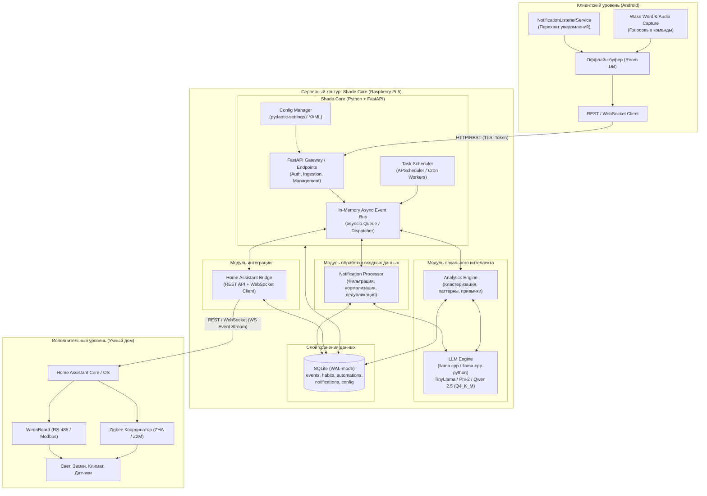
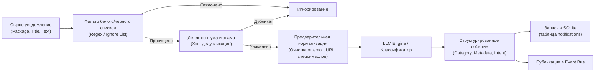
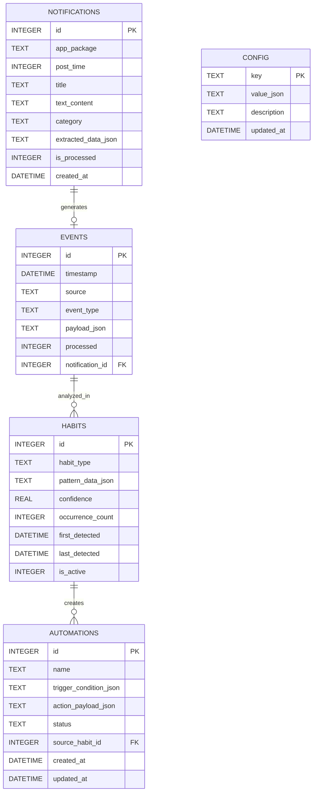
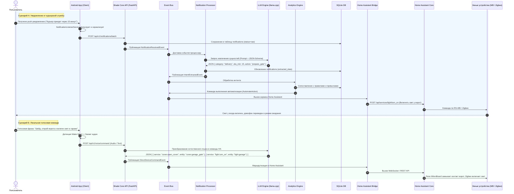
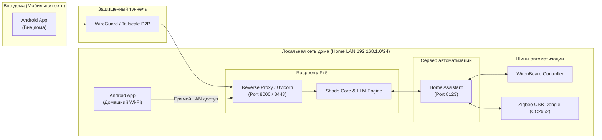

# Архитектура Shade AI

> **Статус документа:** Актуальный (Baseline Architecture)  
> **Версия архитектуры:** 1.0.0  
> **Целевая платформа:** Raspberry Pi 5 (4 GB RAM, Quad-core ARM Cortex-A76 @ 2.4 GHz)  
> **Принцип работы:** 100% автономный контур (Zero-Cloud / Local-First Privacy)

---

## 1. Введение и концепция системы

### 1.1. Назначение Shade AI
**Shade AI** — это полностью локальная, автономная искусственная интеллектуальная система для умного дома, развертываемая на микрокомпьютере **Raspberry Pi 5 (4 GB RAM)**. Система предназначена для сбора, обработки и анализа контекста повседневной жизни пользователя (уведомления со смартфона, голосовые интенты, события умного дома) с целью предиктивного управления домашней автоматизацией без передачи персональных данных на сторонние облачные серверы.

### 1.2. Ключевые архитектурные принципы
1. **Local-First & Zero-Cloud:** Ни один байт пользовательских данных (текст уведомлений, аудиозаписи, паттерны поведения, логи умного дома) не покидает локальную сеть. Все модели машинного обучения и аналитические алгоритмы выполняются на борту Raspberry Pi 5.
2. **Слабая связанность (Decoupled & Event-Driven):** Все внутренние сервисы взаимодействуют через асинхронную шину событий (In-Memory Event Bus), что гарантирует изоляцию сбоев и независимое масштабирование модулей.
3. **Эффективное ресурсопотребление (Resource Budgeting):** Проектирование с жестким учетом лимита оперативной памяти 4 GB. Компоненты оптимизированы под квантованные легковесные модели (GGUF Q4_K_M) и потоковую обработку данных.
4. **Отказоустойчивость (Fault Tolerance):** При недоступности подсистем (например, временная перегрузка LLM или отсутствие связи с Home Assistant) система сохраняет базовую функциональность, буферизирует события и не теряет состояние.

---

## 2. Общая архитектура системы

Система Shade AI разделена на три основных контура:
1. **Клиентский контур:** Android-приложение, выполняющее роль сенсорного шлюза (захват уведомлений, микрофон).
2. **Серверный контур (Raspberry Pi 5):** Ядро Shade Core, локальный движок LLM, аналитический модуль, база данных SQLite и мост Home Assistant.
3. **Исполнительный контур:** Контроллер Home Assistant и оконечные физические устройства (WirenBoard, Zigbee, Wi-Fi).

### 2.1. Высокоуровневая архитектурная диаграмма



---

## 3. Спецификация компонентов системы

### 3.1. Shade Core (Python + FastAPI)
Главный серверный оркестратор системы, развертываемый как системный сервис (systemd) или в оптимизированном Docker-контейнере на Raspberry Pi 5.

* **REST API Gateway:**
  - Реализован на базе **FastAPI** с асинхронными обработчиками (`async`/`await`).
  - Обеспечивает валидацию входящих данных через **Pydantic v2** с минимальными накладными расходами на сериализацию.
  - Аутентификация запросов через заголовок `X-API-Key` (статический pre-shared token для сопряженных устройств).
  - Эндпоинты:
    - `POST /api/v1/notifications/batch` — пакетная загрузка перехваченных уведомлений.
    - `POST /api/v1/voice/command` — прием аудиопотока или распознанного голосового текста.
    - `GET /api/v1/system/status` — телеметрия состояния Raspberry Pi (RAM, CPU temp, статус сервисов).
    - `GET /api/v1/automations` и `POST /api/v1/automations/{id}/trigger` — управление правилами.
    - `GET /api/v1/analytics/habits` — список выявленных привычек и паттернов.
* **Event Bus (Шина событий):**
  - Легковесная внутренняя асинхронная шина pub/sub на базе `asyncio.Queue` и типизированных диспетчеров.
  - Гарантирует изоляцию модулей: генератор события не блокируется ожиданием ответа от потребителей (Analytics, Home Assistant, Notification Processor).
  - Поддержка приоритезации событий: высокоприоритетные команды (например, тревога, критические события) обрабатываются вне очереди аналитических задач.
* **Task Scheduler (Планировщик задач):**
  - Реализация на базе `APScheduler` (AsyncIOScheduler).
  - Фоновые периодические задачи:
    - Агрегация и кластеризация данных за сутки (глубокий анализ в ночное время).
    - Периодическая проверка целостности SQLite и создание локальных бэкапов.
    - Очистка устаревших низкоприоритетных сырых логов (Retention policy: 30–90 дней).
    - Регулярный health check подключения к Home Assistant.
* **Config Manager (Менеджер конфигурации):**
  - Иерархическая конфигурация: переменные окружения (`.env`) -> `config.yaml` -> таблица `config` в SQLite.
  - Горячая перезагрузка параметров без рестарта основного сервиса для некритичных настроек (пороги уверенности аналитики, списки фильтрации приложений).

---

### 3.2. LLM Engine (Локальная языковая модель)
Обеспечивает интеллектуальную интерпретацию неструктурированного текста на естественном языке без обращения к внешним облачным сервисам.

* **Среда выполнения и инференс:**
  - **llama-cpp-python** (сборка с поддержкой ARM NEON и OpenBLAS, скомпилированная под архитектуру Cortex-A76).
  - Режим работы: выделенный фоновый воркер (single-worker process) для предотвращения конкуренции за память и процессорные ядра.
  - Ограничение потоков: `n_threads=4` (задействование всех 4 производительных ядер Pi 5).
* **Модели и квантование:**
  - Поддерживаемый формат: **GGUF**.
  - Степень квантования: **Q4_K_M** (оптимальный баланс между качеством генерации и объемом RAM).
  - Рекомендуемые и тестируемые модели:
    - **TinyLlama 1.1B Chat (Q4_K_M):** ~650 MB RAM, время отклика 150–350 мс. Применяется для быстрой классификации и извлечения сущностей из уведомлений.
    - **Phi-2 2.7B / Phi-3 Mini 3.8B (Q4_K_M):** 1.8–2.3 GB RAM. Применяется для сложного семантического сопоставления и генерации контекстных рекомендаций.
    - **Qwen 2.5 1.5B / 3B Instruct:** Высокое качество работы с русским языком при компактном размере.
* **Структурированный вывод (Constrained Decoding / JSON Mode):**
  - Использование грамматик GBNF (Grammar-Based Sampling) или Pydantic/JSON-schema режимов в `llama.cpp`.
  - Модель гарантированно возвращает валидный JSON без свободных рассуждений, что исключает ошибки парсинга при передаче команд в Shade Core.
* **Пример схемы извлечения интента из уведомления:**
```json
{
  "category": "delivery | transport | finance | calendar | communication | noise",
  "is_actionable": true,
  "action_type": "open_gate | prepare_home | adjust_climate | notify_user | none",
  "entities": {
    "arrival_eta_minutes": 15,
    "courier_service": "CDEK",
    "tracking_code": "12345678"
  },
  "confidence": 0.94
}
```

---

### 3.3. Notification Processor (Обработка уведомлений)
Модуль конвейерной обработки текстовых данных, поступающих от Android-приложения.



* **Этапы обработки:**
  1. **Фильтрация источников:** Отсечение системных сервисов Android, системных уведомлений и приложений не из белого списка.
  2. **Дедупликация (Deduplication):** Скользящее окно хэшей (MD5 заголовка и текста за последние 10 минут) для предотвращения спама повторяющимися пушами мессенджеров или плеера.
  3. **Категоризация:**
     - `delivery` (Курьерские службы: Ozon, Wildberries, Самокат, Яндекс.Еда, CDEK и др.).
     - `calendar` (Встречи, авиабилеты, расписание, напоминания).
     - `communication` (Сообщения с высокой срочностью).
     - `marketing / noise` (Реклама, скидки, промо-акции — автоматически маркируются как не требующие действий).
  4. **Извлечение сущностей через LLM:** Определение расчетного времени прибытия (ETA), статусов доставки («курьер подъезжает»), гео-привязок и генерация триггеров для автоматизаций.

---

### 3.4. Analytics Engine (Аналитический алгоритм)
Модуль поиска скрытых закономерностей в поведении пользователя и автоматического формирования правил управления умным домом.

* **Алгоритмический базис:**
  - Не требует тяжелых нейросетевых моделей; использует статистический анализ временных рядов, оконные агрегации и алгоритмы кластеризации (например, модифицированный алгоритм DBSCAN или Time-Density Estimation).
  - Анализ временных окон: разделение суток на слоты (утро, день, вечер, ночь) с учетом дня недели (будни vs выходные).
* **Анализируемые паттерны (Use Cases):**
  - **Паттерн возвращения домой:** Сопоставление времени отключения от внешних сетей, появления смартфона в домашней Wi-Fi сети, срабатывания внешних датчиков движения и уведомлений от сервисов такси/навигации.
  - **Режим отхода ко сну:** Время постановки смартфона на зарядку, выключение основного освещения, отсутствие активности на датчиках движения.
  - **Утренний сценарий:** Время срабатывания будильника на Android, включение света в ванной, запуск чайника/кофемашины.
* **Жизненный цикл привычки (Habit Lifecycle):**
  1. *Детекция гипотезы:* Событие повторилось $N$ раз (например, 5 раз за 7 дней в интервале $\pm 15$ минут).
  2. *Оценка достоверности (Confidence Score):* Расчет метрики $Score \in [0.0; 1.0]$ на основе повторяемости и дисперсии времени.
  3. *Генерация рекомендации:* При достижении порога ($Score \ge 0.75$) создается рекомендация автоматизации.
  4. *Утверждение:* Пользователь видит предложение в UI приложения (автоматическое подтверждение или требование ручного одобрения).
  5. *Исполнение и адаптация:* Создание записи в таблице `automations`. Если пользователь отменяет автоматизацию вручную, вес правила снижается.

---

### 3.5. Home Assistant Bridge (Интеграция с умным домом)
Двунаправленный шлюз между Shade AI и локальным сервером Home Assistant.

* **Сетевое взаимодействие:**
  - **REST API (`/api/services/{domain}/{service}`):** Отправка императивных команд на управление устройствами (включение света, открытие штор, регулировка термостата, блокировка замка).
  - **WebSocket API (`/api/websocket`):** Постоянное асинхронное соединение с подпиской на шину событий Home Assistant (`subscribe_events` с фильтрацией по `state_changed`).
* **Поддерживаемые экосистемы и устройства:**
  - **WirenBoard:** Промышленные контроллеры автоматизации, релейные блоки и диммеры (подключенные через Modbus / MQTT к Home Assistant).
  - **Zigbee (ZHA / Zigbee2MQTT):** Беспроводные датчики открытия дверей/окон, датчики протечки, температуры и влажности, датчики присутствия (mmWave), беспроводные выключатели.
  - **Wi-Fi / Ethernet:** Локальные интеграции (ESPHome, WLED, умные розетки и ТВ).
* **Отказоустойчивость соединения:**
  - Автоматический реконнект WebSocket с экспоненциальной задержкой (Exponential Backoff).
  - Локальный кэш текущих состояний сущностей (`entity_id` -> `state`, `attributes`) в оперативной памяти Shade Core для мгновенной валидации команд без дополнительных сетевых запросов.
  - Circuit Breaker: при недоступности Home Assistant команды складываются в очередь повторной отправки с ограничением по времени жизни (TTL).

---

### 3.6. Android App (Клиентское приложение)
Нативный Android-клиент, выступающий в роли персонального шлюза контекста пользователя.

* **Технологический стек:**
  - Язык: **Kotlin**.
  - Пользовательский интерфейс: **Jetpack Compose** (Material 3).
  - Асинхронность: **Coroutines**, **StateFlow**, **SharedFlow**.
  - Локальное хранилище: **Room Database** (оффлайн-буфер).
  - Фоновая работа: **WorkManager** и системные Services.
* **Подсистема чтения уведомлений (`NotificationListenerService`):**
  - Системный сервис, регистрируемый в ОС с разрешением `android.permission.BIND_NOTIFICATION_LISTENER_SERVICE`.
  - Перехват объектов `StatusBarNotification`.
  - Извлечение атрибутов: `packageName`, `postTime`, `tickerText`, `extras` (`EXTRA_TITLE`, `EXTRA_TEXT`, `EXTRA_BIG_TEXT`).
  - Первичная фильтрация на устройстве (исключение приватных данных банковских приложений, OTP-кодов и личных переписок по черному списку).
* **Подсистема голосового ввода (Wake Word & Audio Capture):**
  - Легковесное локальное распознавание ключевого слова (например, "Shade" / "Шейд") на базе локального offline-движка (Vosk / Sherpa-ONNX / Porcupine).
  - После детекции ключевого слова: запись голосовой команды через `AudioRecord`, локальная конвертация в компактный формат (Opus / WAV 16kHz Mono) и отправка в Shade Core для распознавания и исполнения.
* **Автономия и синхронизация:**
  - Если смартфон находится вне домашней сети, данные сохраняются в локальную базу SQLite (Room).
  - При подключении к домашнему Wi-Fi или через защищенный VPN-туннель (WireGuard / Tailscale) сервис выполняет пакетную синхронизацию (batch upload).
* **Пользовательский интерфейс:**
  - Отображение статуса соединения с Raspberry Pi (Online / Offline / Syncing).
  - Журнал отправленных уведомлений и действий.
  - Управление списком разрешенных приложений.
  - Просмотр и одобрение автоматизаций, предложенных Analytics Engine.

---

### 3.7. Database (База данных SQLite)
Локальное реляционное хранилище данных Shade AI.

* **Выбор SQLite:**
  - Минимальное потребление памяти (10–30 MB RAM).
  - Отсутствие отдельного серверного процесса (Serverless, in-process).
  - Высокая надежность и соответствие ACID.
* **Оптимизация производительности (PRAGMA):**
  ```sql
  PRAGMA journal_mode = WAL;          -- Параллельное чтение без блокировки записи
  PRAGMA synchronous = NORMAL;         -- Баланс целостности и скорости дискового ввода-вывода
  PRAGMA cache_size = -64000;          -- Выделение до 64 MB памяти под страничный кэш
  PRAGMA foreign_keys = ON;            -- Контроль ссылочной целостности
  PRAGMA temp_store = MEMORY;          -- Временные таблицы и индексы в RAM
  ```

#### Схема таблиц базы данных



#### Детальное описание таблиц

1. **`notifications`** — журнал входящих уведомлений:
   - `id` (INTEGER, PK, Autoincrement) — уникальный идентификатор.
   - `app_package` (TEXT, NOT NULL) — идентификатор пакета приложения (напр. `ru.yandex.taxi`).
   - `post_time` (INTEGER, NOT NULL) — таймстемп генерации на Android.
   - `title` (TEXT) — заголовок пуш-уведомления.
   - `text_content` (TEXT) — тело уведомления.
   - `category` (TEXT) — категория (`delivery`, `calendar`, `transport`, `noise` и др.).
   - `extracted_data_json` (TEXT) — извлеченные сущности в формате JSON (ETA, статус, адрес).
   - `is_processed` (INTEGER, DEFAULT 0) — статус завершения конвейера обработки.
   - `created_at` (DATETIME, DEFAULT CURRENT_TIMESTAMP).

2. **`events`** — общий системный журнал событий:
   - `id` (INTEGER, PK, Autoincrement).
   - `timestamp` (DATETIME, NOT NULL) — время фиксации события.
   - `source` (TEXT, NOT NULL) — источник (`android_notification`, `voice_input`, `home_assistant`, `scheduler`).
   - `event_type` (TEXT, NOT NULL) — тип события (`device_state_changed`, `arrival_intent`, `sleep_mode_triggered`).
   - `payload_json` (TEXT, NOT NULL) — детальные данные события.
   - `processed` (INTEGER, DEFAULT 0) — флаг обработки модулями аналитики.
   - `notification_id` (INTEGER, NULL, FK -> `notifications.id`).

3. **`habits`** — реестр выявленных поведенческих паттернов:
   - `id` (INTEGER, PK, Autoincrement).
   - `habit_type` (TEXT, NOT NULL) — класс паттерна (`arrival_home`, `sleep_routine`, `climate_preference`).
   - `pattern_data_json` (TEXT, NOT NULL) — параметры регулярности (дни недели, временные окна, условия).
   - `confidence` (REAL, NOT NULL) — статистический индекс достоверности (0.0 — 1.0).
   - `occurrence_count` (INTEGER, NOT NULL) — количество зарегистрированных повторений.
   - `first_detected` (DATETIME) — дата обнаружения первого инцидента.
   - `last_detected` (DATETIME) — дата последнего подтверждения.
   - `is_active` (INTEGER, DEFAULT 1) — признак актуальности привычки.

4. **`automations`** — правила исполнения автоматизаций:
   - `id` (INTEGER, PK, Autoincrement).
   - `name` (TEXT, NOT NULL) — человекопонятное наименование.
   - `trigger_condition_json` (TEXT, NOT NULL) — предикат срабатывания (время, состояние датчика, интент).
   - `action_payload_json` (TEXT, NOT NULL) — набор вызовов сервисов Home Assistant.
   - `status` (TEXT, NOT NULL) — `suggested` (предложено), `active` (активно), `disabled` (отключено).
   - `source_habit_id` (INTEGER, NULL, FK -> `habits.id`).
   - `created_at` (DATETIME, DEFAULT CURRENT_TIMESTAMP).
   - `updated_at` (DATETIME, DEFAULT CURRENT_TIMESTAMP).

5. **`config`** — конфигурационные параметры системы:
   - `key` (TEXT, PK) — уникальный ключ настройки.
   - `value_json` (TEXT, NOT NULL) — типизированное значение.
   - `description` (TEXT) — назначение параметра.
   - `updated_at` (DATETIME, DEFAULT CURRENT_TIMESTAMP).

---

## 4. Схема потоков данных (Data Flow)

### 4.1. Основной сквозной поток данных

```
Android App ──> [Уведомления / Голос] ──> Shade Core API ──> LLM Engine ──> Analytics Engine ──> Home Assistant Bridge ──> Умные устройства
```

### 4.2. Детальная Mermaid-диаграмма потока данных



---

## 5. Сетевая топология и безопасность



### 5.1. Принципы сетевой безопасности
1. **Изоляция контура:** Никаких пробросов портов (Port Forwarding) наружу. Доступ вне дома осуществляется исключительно через защищенный VPN-туннель (WireGuard или оверлейную сеть Tailscale).
2. **Токены и авторизация:**
   - Клиент-серверное взаимодействие (Android <-> Shade Core) защищено длинным псевдослучайным Pre-Shared Key (PSK) в заголовке `Authorization: Bearer <TOKEN>`.
   - Сервер-серверное взаимодействие (Shade Core <-> Home Assistant) использует долгоживущие токены доступа Home Assistant (Long-Lived Access Tokens).
3. **Безопасность персональных данных:**
   - Текст личных сообщений и банковские SMS не сохраняются в постоянном виде, если они не несут целевого действия для умного дома.
   - Использование шифрования базы данных SQLite при необходимости (SQLCipher).

---

## 6. Аппаратный профиль и оптимизация для Raspberry Pi 5 (4 GB RAM)

### 6.1. Бюджет оперативной памяти (RAM Allocation)

| Компонент | Выделяемый лимит RAM | Пояснения и оптимизации |
| :--- | :--- | :--- |
| **Операционная система (Raspberry Pi OS Lite 64-bit)** | ~450 MB | Минимальная установка без GUI, отключены ненужные демоны |
| **LLM Engine (`llama.cpp`)** | ~1800–2100 MB | Модель 1.1B–3B в квантовании Q4_K_M, размер контекста `n_ctx=2048` |
| **Shade Core + FastAPI + Uvicorn** | ~180–250 MB | Асинхронный процесс Python 3.11+, оптимизированный парсинг |
| **SQLite DB (Кэш страниц + буферы)** | ~64–100 MB | Настройка `PRAGMA cache_size = -64000` |
| **Home Assistant (если на том же хосте) / Буфер ОС** | ~1000–1200 MB | Дисковый кэш, буфер сетевых сокетов, резерв от OOM |
| **ИТОГО:** | **~3800–4000 MB** | **Безопасная работа без риска Out-Of-Memory** |

### 6.2. Рекомендации по аппаратной части и охлаждению
1. **Накопитель:** Использование **NVMe SSD** через официальный Raspberry Pi M.2 HAT+ (или PCIe-адаптер) вместо карты памяти MicroSD. Это устраняет узкое горлышко дискового ввода-вывода при загрузке весов LLM и гарантирует долговечность базы данных SQLite при частых транзакциях WAL.
2. **Охлаждение:** Обязательно использование **Raspberry Pi Active Cooler** или массивного пассивного алюминиевого корпуса радиаторного типа. Под интенсивной нагрузкой LLM все 4 ядра Cortex-A76 работают на частоте 2.4 GHz; активное охлаждение удерживает температуру процессора ниже 65°C, предотвращая троттлинг.
3. **Настройка zram / Swap:** Настройка сжатого файла подкачки в оперативной памяти (`zram-tools` с алгоритмом `zstd` или `lz4`) для предотвращения аварийного завершения процессов при пиковом потреблении памяти.

---

## 7. Организация репозитория проекта

```
ShadeAI/
├── .github/                      # CI/CD пайплайны сборки и линтинга
├── android/                      # Исходный код мобильного приложения
│   ├── app/
│   │   ├── src/main/java/com/shadeai/
│   │   │   ├── core/            # Базовые сетевые клиенты, DI (Koin/Hilt)
│   │   │   ├── data/            # Room DB, репозитории, модели данных
│   │   │   ├── service/         # NotificationListenerService, WakeWordService
│   │   │   └── ui/              # Jetpack Compose экраны (Dashboard, Settings)
│   │   └── build.gradle.kts
├── core/                         # Серверная часть Shade Core (Python)
│   ├── app/
│   │   ├── api/                 # FastAPI роутеры (v1 эндпоинты)
│   │   ├── core/                # Конфигурация, события (Event Bus), безопасность
│   │   ├── db/                  # Сессии SQLite, миграции Alembic, модели SQLAlchemy
│   │   ├── services/
│   │   │   ├── analytics/       # Analytics Engine (паттерны, привычки)
│   │   │   ├── ha_bridge/       # Home Assistant REST & WebSocket интеграция
│   │   │   ├── llm/             # LLM Engine (обертка над llama-cpp-python)
│   │   │   └── notification/    # Notification Processor (нормализация, парсинг)
│   │   └── main.py              # Точка входа приложения
│   ├── models/                  # Директория для локальных GGUF моделей
│   ├── requirements.txt         # Зависимости Python
│   └── Dockerfile               # Контейнеризация для Raspberry Pi (linux/arm64)
├── docs/                         # Документация проекта
│   ├── architecture.md          # Данный документ архитектуры
│   ├── api_spec.md              # Спецификация REST и Event Bus API
│   └── setup_guide.md           # Руководство по развертыванию на Raspberry Pi 5
└── README.md                     # Общее описание проекта
```

---

## 8. Заключение и дальнейшее развитие

Архитектура **Shade AI** формирует надежный фундамент для создания приватной, по-настоящему умной экосистемы домашней автоматизации. Комбинация легковесных квантованных языковых моделей, алгоритмов поиска поведенческих закономерностей и тесной интеграции с Home Assistant позволяет предвосхищать потребности жильцов дома, сохраняя 100% контроль над данными в рамках одного компактного микрокомпьютера Raspberry Pi 5.
