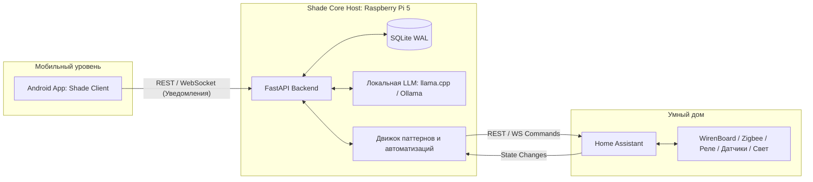
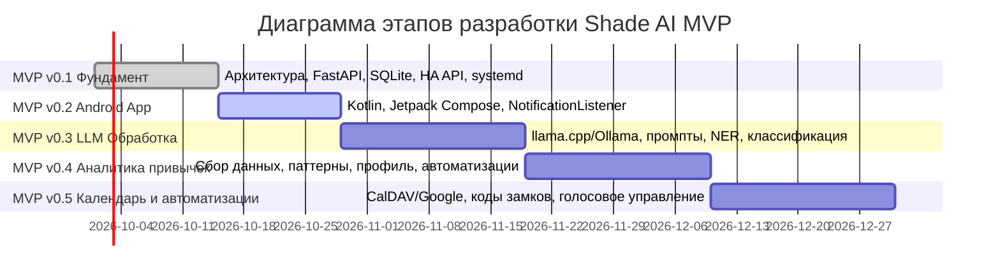

# MVP (Minimum Viable Product) — Shade AI

Документ описывает стратегию поэтапной разработки, вехи (milestones), требования и дорожную карту создания минимально жизнеспособного продукта **Shade AI**.

> **Shade AI** — персональная автономная AI-система для умного дома, развертываемая на базе микрокомпьютера **Raspberry Pi 5** (4GB RAM). Система объединяет возможности локальных нейросетевых моделей (LLM), интеграцию с платформой домашней автоматизации Home Assistant и контекст из мобильного окружения пользователя (Android) для проактивного управления домом и цифровым расписанием с гарантией 100% приватности данных.

---

## 1. Общая архитектурная концепция и цели MVP

Основная цель MVP — на практике проверить гипотезу о том, что связка локальной LLM на одноплатном ПК, мобильного агента сбора контекста (уведомлений) и платформы умного дома Home Assistant способна существенно повысить комфорт и автоматизацию повседневных сценариев без зависимости от внешних облачных сервисов.



### Ключевые принципы MVP:
1. **Локальность и приватность**: Персональные данные, история уведомлений и контекст событий не покидают периметр локальной сети.
2. **Низкие накладные расходы**: Серверная часть и база данных оптимизированы под скромные ресурсы RPi 5 (4GB RAM).
3. **Модульность**: Каждый этап MVP инкрементально добавляет самодостаточную ценность, не нарушая работоспособность предыдущих компонентов.
4. **Отказоустойчивость**: Падение или задержка инференса LLM не должны блокировать базовые функции умного дома и управление освещением.

---

## 2. Сводная таблица Roadmap (Дорожная карта)

| Этап | Название | Приоритет | Примерные сроки | Зависимости | Ключевой результат (Milestone) |
| :--- | :--- | :---: | :---: | :--- | :--- |
| **MVP v0.1** | **Фундамент (Core & HA)** | **P0 (Критический)** | 1–2 недели | Raspberry Pi 5, Home Assistant | Работающий сервер Shade Core с REST API, БД SQLite и управлением светом через HA |
| **MVP v0.2** | **Android App (Телеметрия)** | **P0 (Критический)** | 1–2 недели | MVP v0.1, Android-устройство | Мобильное приложение, стабильно перехватывающее уведомления и передающее их на сервер |
| **MVP v0.3** | **LLM Обработка (Intelligence)**| **P1 (Высокий)** | 2–3 недели | MVP v0.1, MVP v0.2 | Локальная нейросеть извлекает структурированные данные (дата, время, тип, приоритет) из текста |
| **MVP v0.4** | **Аналитика привычек (Habits)** | **P1 (Высокий)** | 2–3 недели | MVP v0.1, MVP v0.3 | Алгоритм обнаружения паттернов прихода/ухода, профиль привычек и проактивные сценарии |
| **MVP v0.5** | **Календарь + Умные сценарии** | **P2 (Средний)** | 2–3 недели | MVP v0.3, MVP v0.4 | Интеграция с календарями, динамические коды замков под доставку, голосовой ввод |

**Общий расчетный срок реализации MVP (v0.1 – v0.5)**: **8–13 недель**.

---

## 3. Детализация этапов реализации



---

### MVP v0.1 — Фундамент (Core Infrastructure & Home Assistant)

* **Цель**: Развертывание базовой отказоустойчивой серверной инфраструктуры, способной принимать внешние данные, сохранять их в локальную базу данных и взаимодействовать с устройствами умного дома через Home Assistant.
* **Приоритет**: **P0 (Критический, блокирующий)**
* **Примерные сроки**: 1–2 недели (10–14 рабочих дней)
* **Зависимости**:
  - Аппаратная платформа Raspberry Pi 5 (4GB RAM) с установленной 64-битной ОС (Raspberry Pi OS / Ubuntu Server).
  - Развернутый инстанс Home Assistant с настроенным Long-Lived Access Token.
  - Осветительный прибор / реле (WirenBoard, Zigbee или Wi-Fi), подключенный к HA.

#### Задачи:
- [ ] **Создать структуру проекта (Python + FastAPI)**:
  - Инициализация репозитория, настройка виртуального окружения (Poetry).
  - Конфигурация линтеров (`ruff`, `mypy`) и `pytest`.
  - Модульная структура каталогов (`app/api`, `app/core`, `app/models`, `app/services`, `app/db`).
  - Управление настройками окружения через `pydantic-settings` (.env).
- [ ] **Настроить SQLite + SQLAlchemy + Alembic**:
  - Инициализация асинхронного движка `create_async_engine` с SQLite (`sqlite+aiosqlite:///...`).
  - Включение режима `PRAGMA journal_mode=WAL` и `PRAGMA foreign_keys=ON`.
  - Настройка миграций Alembic (асинхронный шаблон `env.py`).
  - Создание базовых таблиц: `events_log`, `notifications_raw`, `device_states`.
- [ ] **REST API: эндпоинты для приёма уведомлений и управления**:
  - `POST /api/v1/notifications/ingest` — прием сырых уведомлений от клиента.
  - `POST /api/v1/ha/action` — проксирование вызова сервисов Home Assistant.
  - `GET /api/v1/health` — проверка состояния сервиса и доступности базы/HA.
- [ ] **Интеграция с Home Assistant API**:
  - Асинхронный HTTP-клиент (на базе `httpx`) для работы с HA REST API.
  - Реализация методов чтения состояния сущностей (`GET /api/states/<entity_id>`).
  - Реализация методов отправки команд (`POST /api/services/light/turn_on`, `turn_off`, `toggle`).
- [ ] **Базовое логирование событий в БД**:
  - Запись всех входящих запросов и ответов HA в таблицу `events_log`.
  - Логирование в консоль и локальный файл с ротацией через `Loguru`.
- [ ] **Настройка systemd-сервиса на RPi**:
  - Создание unit-файла `shade-core.service`.
  - Настройка автозапуска при загрузке системы, прав доступа пользователя `kirill`, автоперезапуска `Restart=always`.

#### Критерии готовности (Definition of Done):
- [x] Сервер Shade Core автоматически стартует как systemd-сервис на Raspberry Pi 5.
- [x] Отправка тестового POST-запроса через `curl` успешно сохраняет уведомление в локальной SQLite БД.
- [x] Через эндпоинт `/api/v1/ha/action` можно физически включить и выключить свет в комнате через Home Assistant.
- [x] При перезагрузке RPi сервис самостоятельно восстанавливает работу без вмешательства разработчика.

> [!NOTE]
> На этом этапе закладывается архитектура асинхронной обработки, исключающая блокировки event loop при длительных I/O операциях.

---

### MVP v0.2 — Android App (Client & Notification Capture)

* **Цель**: Разработка клиентского Android-приложения, перехватывающего входящие мобильные уведомления, производящего их предварительную фильтрацию и транслирующего данные на сервер Shade Core по локальной сети.
* **Приоритет**: **P0 (Критический, основной источник контекста)**
* **Примерные сроки**: 1–2 недели (7–12 рабочих дней)
* **Зависимости**:
  - Завершенный этап **MVP v0.1** (доступный эндпоинт `/api/v1/notifications/ingest`).
  - Android-смартфон (Android 10+, API Level 29+).
  - Доступ смартфона к RPi5 в пределах одной домашней Wi-Fi сети.

#### Задачи:
- [ ] **Проект на Kotlin + Jetpack Compose**:
  - Создание проекта в Android Studio с современным стеком (Gradle Version Catalogs, Compose Material 3).
  - Архитектура MVVM / MVI с `StateFlow` и корутинами.
- [ ] **NotificationListenerService — перехват уведомлений**:
  - Реализация сервиса-наследника `NotificationListenerService`.
  - Регистрация разрешения `BIND_NOTIFICATION_LISTENER_SERVICE` в `AndroidManifest.xml`.
  - Извлечение метаданных: имя пакета приложения (`packageName`), заголовок (`title`), текст сообщения (`text`), время получения (`postTime`), системный ID.
- [ ] **Фильтрация уведомлений (по приложениям)**:
  - Механизм белого/черного списка приложений (например, включение только мессенджеров Telegram/WhatsApp, банковских приложений, доставки Ozon/Wildberries/Яндекс Go).
  - Игнорирование служебных, системных и спам-уведомлений до отправки по сети.
- [ ] **Отправка уведомлений на Shade Core API**:
  - Реализация сетевого слоя на `Retrofit 2` или `Ktor Client` + `Kotlinx.serialization`.
  - Локальный буфер (буферизация при отсутствии связи с сервером на базе Room / SharedPreferences).
  - Повторная отправка сообщений (Retry policy) при появлении соединения с домашним Wi-Fi.
- [ ] **Минимальный UI: статус подключения, настройки фильтров**:
  - Экран состояния подключения (статус Shade Core, IP/порт сервера, пинг).
  - Экран выбора отслеживаемых приложений с переключателями.
  - Лог последних перехваченных и отправленных уведомлений для самодиагностики.

#### Критерии готовности (Definition of Done):
- [x] Приложение установлено на Android-устройство и получило системное разрешение на доступ к уведомлениям.
- [x] Входящее пуш-уведомление от разрешенного приложения (например, Telegram или службы доставки) перехватывается в фоновом режиме.
- [x] Уведомление доставляется на Shade Core и фиксируется в SQLite БД в неизменном виде.
- [x] Приложение корректно работает в фоне при выключенном экране телефона и не убивается агрессивным энергосбережением ОС.

> [!TIP]
> Для предотвращения выгрузки сервиса системой Android необходимо настроить работу с `Foreground Service` (с незаметным уведомлением о статусе синхронизации) и запросить отключение оптимизации батареи для приложения.

---

### MVP v0.3 — LLM Обработка (Local AI Intelligence)

* **Цель**: Внедрение локального искусственного интеллекта на базе квантованной компактной LLM для семантического анализа неструктурированных текстов уведомлений, извлечения фактов, сущностей и классификации событий.
* **Приоритет**: **P1 (Высокий, ключевая инновация)**
* **Примерные сроки**: 2–3 недели (12–18 рабочих дней)
* **Зависимости**:
  - Завершенные этапы **MVP v0.1** и **MVP v0.2**.
  - Настроенная среда инференса на Raspberry Pi 5 (llama.cpp или легковесный демон Ollama).
  - Достаточный объем свободной оперативной памяти на RPi 5 (не менее 2.5 GB свободно под модель).

#### Задачи:
- [ ] **Развернуть llama.cpp / Ollama на RPi5**:
  - Компиляция `llama.cpp` с флагами ARM NEON оптимизации или установка headless Ollama.
  - Загрузка и бенчмарк моделей в квантовании Q4_K_M:
    - *TinyLlama-1.1B-Chat-v1.0* (быстрый baseline, ~700 MB RAM);
    - *Phi-2 2.7B* / *Gemma 2B* (высокая точность структурированного вывода, ~1.5–1.8 GB RAM).
  - Измерение скорости инференса (target: >= 8-12 токенов/сек для RPi 5).
- [ ] **Промпты для парсинга уведомлений**:
  - Системные промпты с zero-shot / few-shot примерами для русского языка.
  - Использование режима Structured Outputs (JSON Schema / GBNF грамматики для гарантированного валидного JSON-ответа).
- [ ] **Извлечение сущностей (NER)**:
  - Извлечение даты (`date`) и времени (`time`) события (с нормализацией относительных дат вроде «сегодня в 15:00», «через 2 часа»).
  - Выделение типа события (`event_type`), контрагента/отправителя (`source`), числовых значений (код замка, номер заказа, сумма).
- [ ] **Классификация уведомлений**:
  - Распределение по категориям: `delivery` (доставка), `meeting` (встреча), `reminder` (напоминание), `security` (безопасность), `finance` (финансы), `spam` (информационный мусор).
  - Определение приоритета события (`CRITICAL`, `HIGH`, `NORMAL`, `LOW`).
- [ ] **Сохранение структурированных данных в БД**:
  - Таблица `parsed_events` в SQLite со связью `one-to-one` к `notifications_raw`.
  - Сохранение JSON-полей с атрибутами события и статусом обработки (`pending`, `processed`, `failed`).
  - Фоновый worker (асинхронная очередь `asyncio.Queue` / Celery/arq) для изоляции инференса от HTTP-эндпоинта приема.

#### Критерии готовности (Definition of Done):
- [x] Локальная LLM запускается на RPi 5 без исчерпания памяти (Out-Of-Memory / OOM).
- [x] Уведомление «Курьер приедет сегодня с 16:00 до 18:00, код домофона 45K» парсится моделью в структурированный JSON:
  ```json
  {
    "category": "delivery",
    "priority": "HIGH",
    "time_start": "16:00",
    "time_end": "18:00",
    "pin_code": "45K",
    "action_required": true
  }
  ```
- [x] Время обработки одного типичного уведомления не превышает 3–5 секунд.
- [x] Спам-уведомления и реклама отсеиваются и помечаются как `spam`, не засоряя события умного дома.

> [!WARNING]
> Инференс на CPU может кратковременно нагревать Raspberry Pi 5. Обязательно наличие активного кулера (Active Cooler для RPi 5), предотвращающего термо-троттлинг процессора.

---

### MVP v0.4 — Аналитика привычек (Habits Engine & Proactive Automation)

* **Цель**: Создание модуля накопления поведенческих паттернов пользователя на основе данных с датчиков умного дома и мобильного телефона для реализации проактивных автоматизаций без жестко заданных таймеров.
* **Приоритет**: **P1 (Высокий)**
* **Примерные сроки**: 2–3 недели (12–18 рабочих дней)
* **Зависимости**:
  - Завершенные этапы **MVP v0.1** – **MVP v0.3**.
  - Наличие физических сенсоров в Home Assistant: датчики движения/присутствия, датчик открытия входной двери, трекинг статуса смартфона в Wi-Fi сети (device tracker).
  - Накопленный датасет событий минимум за 7–10 дней реальной эксплуатации.

#### Задачи:
- [ ] **Сбор данных: время прихода/ухода, взаимодействие с устройствами**:
  - Подписка на шину событий Home Assistant через WebSocket API.
  - Непрерывный сбор изменений состояний (открытие дверей, движение, включение/выключение света, подключение телефона к домашней Wi-Fi сети).
  - Агрегация телеметрии в таблицу `sensor_history`.
- [ ] **Алгоритм обнаружения паттернов (по расписанию и последовательностям)**:
  - Базовые статистические алгоритмы (вычисление медианного времени ухода на работу и возвращения домой в будни и выходные).
  - Кластеризация временных окон активности пользователя (DBSCAN / скользящее среднее).
  - Определение сценариев: «Утренний подъем», «Уход из дома», «Возвращение домой», «Отход ко сну».
- [ ] **Формирование профиля привычек**:
  - Модель хранения привычек: время события, доверительный интервал вероятности, список ассоциированных устройств.
  - Периодический пересчет профиля (например, каждую ночь).
- [ ] **Подсказки при возвращении домой**:
  - Детекция триггера приближения или подключения к Wi-Fi / срабатывания входного датчика.
  - Формирование контекстного состояния (температура в квартире, ожидаемые курьеры из `parsed_events`).
  - Отправка push-уведомления на телефон с персонализированным саммари.
- [ ] **Базовые автоматизации (включить свет при приходе, выключить при уходе)**:
  - Автоматическое выключение всего света и электроприборов при фиксации ухода (если в доме нет движения > 15 минут).
  - Включение освещения в прихожей при открытии двери в темное время суток (по датчику освещенности или астрономическому закату).
  - Защита от ложных срабатываний (подтверждение наличия хозяина по Wi-Fi).

#### Критерии готовности (Definition of Done):
- [x] Система автоматически определяет факт ухода и возвращения пользователя без ручного нажатия кнопок.
- [x] При уходе пользователя из дома система корректно отключает забытый свет через Home Assistant.
- [x] При входе в квартиру вечером автоматически включается комфортный световой сценарий в прихожей.
- [x] В логах формируется математически обоснованный профиль типичного расписания пользователя с вероятностями событий.

---

### MVP v0.5 — Календарь + Умные автоматизации (Contextual Fusion & Voice)

* **Цель**: Расширение системы внешними источниками контекста (персональный календарь), сквозная кросс-модульная автоматизация (связка уведомление о доставке → код замка) и добавление голосового взаимодействия.
* **Приоритет**: **P2 (Средний, масштабирование функционала)**
* **Примерные сроки**: 2–3 недели (12–18 рабочих дней)
* **Зависимости**:
  - Стабильно функционирующие этапы **MVP v0.1** – **MVP v0.4**.
  - Учетная запись Google Calendar или собственный сервер CalDAV (Nextcloud / Radicale).
  - Умный замок / кодовая панель домофона, интегрированные в Home Assistant (или эмулятор для тестов).

#### Задачи:
- [ ] **Интеграция с Google Calendar / CalDAV**:
  - Модуль периодической синхронизации событий календаря (через CalDAV или Google Calendar API).
  - Сопоставление событий календаря («Встреча онлайн», «Отпуск», «Поездка») с профилем привычек умного дома.
- [ ] **Напоминания на основе событий**:
  - Проактивные уведомления на Android-клиент с учетом расчетного времени на сборы и дорожной обстановки.
  - Изменение режима дома во время важных рабочих созвонов (автоматический перевод домофона в беззвучный режим, сценарий «Не беспокоить»).
- [ ] **Автоматизации: «доставка в 16:00» → генерация одноразового кода для замка**:
  - Связка LLM-парсера уведомлений маркетплейсов с сервисом управления доступом.
  - Если в уведомлении распознан временной слот приезда курьера и курьерской службы, генерируется временный PIN-код для умного замка (действующий в интервале ±30 минут от слота доставки).
  - Отправка SMS / сообщения курьеру или сохранение кода в заметках заказа.
- [ ] **Голосовое управление (запись с микрофона на Android)**:
  - Добавление в Android-приложение кнопки записи голосовой команды (интеграция с Android SpeechRecognizer или локальной легковесной моделью Whisper / Vosk).
  - Передача распознанного текста в Shade Core на обработку LLM как пользовательского намерения (Intent recognition: «Сделай свет в гостиной потише и закрой шторы»).
  - Выполнение сгенерированного действия в Home Assistant с подтверждающим голосовым/текстовым ответом.

#### Критерии готовности (Definition of Done):
- [x] События из календаря отображаются в единой ленте событий Shade Core.
- [x] При поступлении уведомления о доставке автоматически создается правило доступа к замку/домофону на указанный интервал времени.
- [x] Пользователь может нажать кнопку микрофона в Android-приложении, произнести естественную команду на русском языке, и система выполнит соответствующее действие в Home Assistant.
- [x] Все компоненты MVP работают согласованно как единый автономный программно-аппаратный комплекс.

---

## 4. Матрица рисков и стратегии митигации

| Риск | Влияние | Вероятность | Способ митигации в рамках MVP |
| :--- | :---: | :---: | :--- |
| **Дефицит RAM на RPi 5 при запуске LLM** | Высокое | Средняя | Строгий выбор моделей (до 2-3B параметров в квантовании Q4_K_M), своп-файл на быстром NVMe/SD, использование `llama.cpp` без тяжелых оверхедов, ограничение длины контекста (контекстное окно 1024–2048 токенов). |
| **Убийство фонового NotificationListener системой Android** | Высокое | Высокая | Реализация Foreground Service с постоянным уведомлением, явный запрос у пользователя на исключение из списка Doze / Battery Saver, автоперезапуск через WorkManager. |
| **Галлюцинации LLM при парсинге уведомлений** | Среднее | Средняя | Использование JSON Schema / GBNF-грамматик (Grammar-based sampling), валидация полей через Pydantic v2 перед записью в БД, fallback на регулярные выражения для критических паттернов (коды, телефоны). |
| **Нестабильность локальной сети (потеря связи с RPi)** | Среднее | Средняя | Локальный кэш и очередь на смартфоне (Room DB) с экспоненциальным backoff при повторных попытках отправки после восстановления связи. |
| **Сложность тестирования умного замка / специфических датчиков** | Низкое | Средняя | Создание программных mock-сервисов и виртуальных сущностей (Virtual entities) в Home Assistant для отладки логики до подключения реального железа. |

---

## 5. Метрики успеха и переход к post-MVP

После завершения этапа **MVP v0.5** проект признается успешно прошедшим фазу валидации гипотез при достижении следующих метрик:

1. **Автономность**: Система работает непрерывно не менее 14 дней без перезагрузок и ручных вмешательств.
2. **Точность извлечения данных**: Не менее **90%** входящих уведомлений курьерских служб и напоминаний корректно распознаются и парсятся локальной нейросетью.
3. **Скорость реакции**: Задержка выполнения базовых команд управления умным домом (свет, реле) не превышает **200 мс**, а время полной обработки уведомления нейросетью — не более **4 секунд**.
4. **Приватность**: 0 байт персональных данных передано во внешние облачные API (за исключением стандартного опционального коннектора Google Calendar, если выбран он, а не локальный CalDAV).
5. **Энергоэффективность**: Потребление Raspberry Pi 5 в режиме постоянного дежурства не превышает 5–12 Вт.

Дальнейшее развитие (Post-MVP v1.0+):
- Переход к мультимодальности (обработка изображений с камер домофона).
- Локальный синтез речи (TTS) для голосовых оповещений через умные колонки.
- Расширение поддержки устройств на базе протокола Matter / Thread.
- Автономный Web-дашборд аналитики привычек на базе Vue.js.
