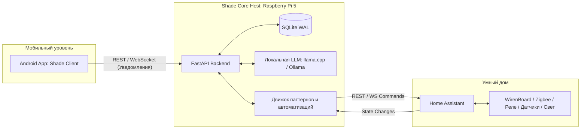

# MVP (Minimum Viable Product) — Shade AI

Документ содержит ТЗ и упорядоченные задачи реализации **Shade AI** от текущего скелета до функционального MVP. Наличие кода и подтверждённая готовность учитываются отдельно.

Состояние последней сессии, решения и инструкции продолжения: [память проекта](project-context.md). Правила работы и порядок чтения: [AGENTS.md](../AGENTS.md).

> **Shade AI** — персональная автономная AI-система для умного дома, развертываемая на базе микрокомпьютера **Raspberry Pi 5** (4GB RAM). Система объединяет возможности локальных нейросетевых моделей (LLM), интеграцию с платформой домашней автоматизации Home Assistant и контекст из мобильного окружения пользователя (Android) для проактивного управления домом и цифровым расписанием с гарантией 100% приватности данных.

---

## 1. Общая архитектурная концепция и цели MVP

Основная цель MVP — на практике проверить гипотезу о том, что связка локальной LLM на одноплатном ПК, мобильного агента сбора контекста (уведомлений) и платформы умного дома Home Assistant способна существенно повысить комфорт и автоматизацию повседневных сценариев без зависимости от внешних облачных сервисов.

```mermaid
flowchart LR
    subgraph Mobile [Мобильный уровень]
        Android[Android App: Shade Client]
    end

    subgraph Core [Shade Core Host: Raspberry Pi 5]
        API[FastAPI Backend]
        DB[(SQLite WAL)]
        LLM[Локальная LLM: llama.cpp / Ollama]
        Rules[Движок паттернов и автоматизаций]
        
        API <--> DB
        API <--> LLM
        API <--> Rules
    end

    subgraph SmartHome [Умный дом]
        HA[Home Assistant]
        Devices[WirenBoard / Zigbee / Реле / Датчики / Свет]
        
        HA <--> Devices
    end

    Android -- "REST / WebSocket (Уведомления)" --> API
    Rules -- "REST / WS Commands" --> HA
    HA -- "State Changes" --> Rules
```

### Ключевые принципы MVP:
1. **Локальность и приватность**: Персональные данные, история уведомлений и контекст событий не покидают периметр локальной сети.
2. **Низкие накладные расходы**: Серверная часть и база данных оптимизированы под скромные ресурсы RPi 5 (4GB RAM).
3. **Модульность**: Каждый этап MVP инкрементально добавляет самодостаточную ценность, не нарушая работоспособность предыдущих компонентов.
4. **Отказоустойчивость**: Падение или задержка инференса LLM не должны блокировать базовые функции умного дома и управление освещением.

---

## 2. Отправная точка и порядок работы

Этот документ — ТЗ и план реализации. Состояние исходников проверено **2026-10-01**, исходная ревизия — `d4ae2d7`. Сейчас существует **скелет с отдельными небольшими реализациями**. Ни один функциональный этап MVP целиком не подтверждён.

### 2.1. На что можно опереться

| Компонент | Уже написано | Что это пока не подтверждает |
| :--- | :--- | :--- |
| [Core](../core/app/main.py) | FastAPI, Bearer-проверка, четыре маршрута; установка Python 3.11, настройка SHADE_API_KEY и запуск Docker проверены в TASK-01 | Полный контракт API и работу на Pi |
| [БД](../core/app/db/models.py) | SQLite WAL, модели notifications_raw и events_log, создание таблиц через create_all | Миграции, запись журнала событий, хранение состояний устройств и результатов анализа |
| [HA-клиент](../core/app/services/ha_bridge/client.py) | HTTP-методы чтения состояний и вызова сервиса HA | Управление физическим устройством и получение телеметрии по WebSocket |
| [Android](../android/app/src/main/java/com/shadeai/app/MainActivity.kt) | Экран адреса/health, Retrofit, Room, код NotificationListener | Успешную сборку APK, авторизацию, перехват на телефоне и надёжную доставку |
| [Веб](../web/src/App.tsx) | Экран ключа, состояния Core и таблицы уведомлений; API-клиент и стили | Проверку интерфейса в браузере, управление домом и автоматизации |
| [Шина событий](../core/app/events/bus.py) | subscribe/publish через asyncio.create_task | Рабочую очередь, подписчиков, восстановление задач и обработку сбоев |
| [LLM](../core/app/services/llm/engine.py) и [обработка](../core/app/services/notification/processor.py) | Интерфейс и заглушки с фиксированным ответом | Загрузку модели, классификацию и извлечение сущностей |
| [Аналитика](../core/app/services/analytics/engine.py) | Файл с описанием будущего модуля | Какой-либо алгоритм привычек |
| [Скрипт моделей](../scripts/download_model.sh) | Код скачивания TinyLlama/Qwen GGUF | Инференс и замеры на Raspberry Pi |

При первоначальной проверке ревизии `d4ae2d7` прошли четыре теста Core с отдельной тестовой БД и недоступным локальным HA, `ruff check app` и сборка веба. В TASK-01 подтверждены чистая установка Python 3.11 и запуск Docker ([отчёт](reports/task-01.md)). В TASK-02 тесты изолированы: теперь **29 тестов проходят** без рабочего `.env`, БД и HA ([отчёт](reports/task-02.md)). APK, браузерный сценарий, успешная команда физическому устройству HA и работа на Pi не проверены.

### 2.2. Этапы и результаты

| Этап | Задачи | Результат для закрытия этапа | Статус |
| :--- | :--- | :--- | :--- |
| Подготовка | TASK-01–03 | Core воспроизводимо запускается, тесты изолированы, Android собирается | Не завершён |
| MVP v0.1 — Core, HA и базовый веб | TASK-04–08; подготовка TASK-01–02 | Хранение и API реализованы, веб проверен, свет управляется через Core, сервис восстанавливается после перезагрузки Pi | Не завершён |
| MVP v0.2 — Android | TASK-09–13; подготовка TASK-03 | Выбранные уведомления доставляются с телефона в Core и веб, включая восстановление после потери сети | Не завершён |
| Подготовка данных для v0.4 | TASK-14 | Начинает накапливаться история выбранных датчиков HA | Не начат |
| MVP v0.3 — LLM | TASK-15–19 | Модель локально обрабатывает уведомления, результаты сохраняются и отображаются, качество и RAM измерены | Не начат |
| MVP v0.4 — привычки | TASK-20–22; сбор данных TASK-14 | Алгоритм выявляет паттерны, пользователь управляет предложениями и сценариями прихода/ухода | Не начат |
| MVP v0.5 — календарь, голос, доставка | TASK-23–26 | Работают локальные напоминания, голосовая команда и сценарий временного доступа | Не начат |
| Приёмка MVP | TASK-27 | Есть результаты длительной эксплуатации и измерений по разделу 5 | Не начата |

Нумерация задаёт рекомендуемый порядок для соло-разработки. Зависимости каждой задачи указаны отдельно: например, работу над Android можно продолжать с Core на компьютере, пока нет Pi для TASK-08. Отсутствие SDK блокирует проверку Android, а отсутствие железа — соответствующую аппаратную проверку; это не блокирует независимые задачи Core и веба. TASK-14 стоит перед LLM, чтобы заранее накопить данные для аналитики.

Сроки назначаются после первых проверок установки, Android SDK и доступного оборудования. Календарная диаграмма с заранее завершённым v0.1 не используется.

### 2.3. Правила закрытия задач

- TASK-01–02 закрыты; TASK-03–27 открыты. Существующий файл, заглушка или успешная сборка не заменяют проверку требуемого поведения.
- Для закрытия указывать ревизию, выполненные проверки и результат. Аппаратные критерии закрывать только после проверки на устройстве.
- Изменения API сначала согласовать с [контрактом](api-spec.md), затем синхронно реализовать в Core и затронутых клиентах. Существующий ha/action сохранять до проверенного перехода клиентов.
- Данные и модели обрабатываются локально; бюджет — 4 GB RAM. Для первых интеграционных проверок использовать синтетические уведомления.
- Визуальные задачи выполнять по [брендбуку](brand.md); требования хранения — по [архитектуре](architecture.md), стек — по [tech-stack.md](tech-stack.md).

## 3. Задачи по порядку

### Подготовка существующего скелета

#### TASK-01 — Воспроизводимый запуск и конфигурация Core

- **Исходное состояние:** requirements, Dockerfile, Settings и пример .env; строка `[dev]` мешала установке, Settings читала API_KEY вместо документированного SHADE_API_KEY.
- [x] **Сделать:** исправить формат зависимостей; реализовать чтение SHADE_API_KEY; организовать локальную генерацию ключа при настройке; исключить незаметный запуск с демонстрационным ключом; описать установку и ошибки настройки. LLM-зависимости оставить отдельными.
- **Готово, когда:** на чистом окружении устанавливаются зависимости, Core запускается по инструкции, ключ из .env принимается, неверный отклоняется; Dockerfile собирается, секреты не включены в образ.
- **Проверено 2026-10-01:** чистое окружение Python 3.11, `pip check`, 22 теста, `ruff check app tests`, запуск Uvicorn и Docker с внешним `.env`, health и Bearer, отсутствие рабочего `.env` в образе. Коммит реализации — `c49bc06`. Подробности — [отчёт TASK-01](reports/task-01.md), запуск — [Core README](../core/README.md).
- **Зависимости:** нет. **Область:** core, docs.

#### TASK-02 — Независимые тесты бэкенда

- **Исходное состояние:** 22 теста, включая конфигурацию и настройку ключа из TASK-01; API-тесты использовали общую конфигурацию БД и запросы к настроенному HA. conftest задавал только тестовый ключ при отсутствии переменной окружения.
- [x] **Сделать:** выделить временную БД на тесты, подменять HA-клиент/транспорт; убрать зависимость от рабочего .env и реального HA, сохранив проверки конфигурации из TASK-01. Дальнейшие задачи дополняют эти тесты своими сценариями.
- **Готово, когда:** pytest проходит с выключенным HA, не меняет рабочую БД и не зависит от сохранённых уведомлений; ruff проходит.
- **Проверено 2026-10-01:** обычный pytest — 29 passed; тот же набор проходит с синтетическим некорректным `.env`/окружением, контрольные `.env` и SQLite не изменяются. Два теста БД проходят в обратном порядке, сетевая защита подтверждена ожидаемым отказом отдельного probe-теста; ruff проходит. Отдельный коммит реализации определяется по TASK-02 в git log. [Отчёт TASK-02](reports/task-02.md).
- **Зависимости:** TASK-01. **Область:** core.

#### TASK-03 — Первая проверенная сборка Android

- **Уже есть:** Gradle-проект, Compose, ресурсы; в MainActivity используется Composable без импорта.
- [ ] **Сделать:** устранить ошибки компиляции; собрать APK в Android Studio с SDK; установить на телефон; проверить экран, сохранение адреса и доступность разрешённого локального транспорта. Настройка транспорта должна быть явной, без глобального отключения проверок сертификатов.
- **Готово, когда:** APK собирается и запускается, экран не падает, адрес сохраняется после перезапуска; записаны версии SDK и устройства. Пока не требовать работающего перехвата уведомлений.
- **Зависимости:** нет; нужен Android SDK и телефон для установки. **Область:** android, docs.

### MVP v0.1 — Реализовать фундамент Core и базовый веб

#### TASK-04 — Миграции и базовая схема данных

- **Уже есть:** notifications_raw и events_log; таблицы создаются через create_all, миграций и device_states нет.
- [ ] **Сделать:** настроить Alembic; создать начальную миграцию и device_states; описать переход существующей БД скелета без потери уведомлений. Будущие таблицы добавлять отдельными миграциями в соответствующих задачах.
- **Готово, когда:** пустая и существующая БД скелета переводятся на актуальную схему; WAL и foreign_keys сохраняются; повторный запуск миграций не теряет данные.
- **Зависимости:** TASK-01–02. **Область:** core, docs.

#### TASK-05 — Реализовать надёжный приём и историю уведомлений

- **Уже есть:** POST сохраняет текст, GET возвращает страницу; total равен её размеру, timestamp не проверяется, обработчик возвращает фиксированный результат.
- [ ] **Сделать:** реализовать валидацию времени/приоритета/размеров, корректные limit/offset/total и чтение отдельной записи; определить договорённость об идентификаторах и повторных отправках, затем добавить защиту от дублей; применить правила исключения чувствительных данных до постоянного сохранения; определить срок хранения и очистку. Статус ответа должен отражать реально выполненный этап, без фиктивного результата LLM.
- **Готово, когда:** допустимое уведомление сохраняется и читается; повторная доставка не создаёт дубль; некорректные данные отклоняются; тестовые банковские коды и исключённые сообщения не попадают в БД/логи; пагинация и очистка проверены.
- **Зависимости:** TASK-04. **Область:** core, docs; при изменении формата — клиенты.

#### TASK-06 — Реализовать интеграцию с HA и журнал действий

- **Уже есть:** REST-клиент и ha/action; успешные команды не проверены, EventLog не заполняется.
- [ ] **Сделать:** реализовать проверенные сценарии чтения состояния и вызова сервиса; обработать таймаут, неверный токен и ошибки HA; записывать результаты в events_log без секретов; добавить чтение журнала и необходимые маршруты устройств по API-спецификации. Уточнить health: доступность БД и HA, фактическое состояние сервисов. Настроить локальные логи с ротацией.
- **Готово, когда:** тесты проверяют успех и отказ HA; журнал различает выполненную и неудачную команду; недоступность HA не ломает приём уведомлений. Физическое включение света проверяется в TASK-08.
- **Зависимости:** TASK-04 и базовые тесты TASK-02. **Область:** core, docs.

#### TASK-07 — Реализовать и проверить базовый веб-интерфейс

- **Уже есть:** один React-экран ключа, health и уведомлений; сборка прошла, браузерный сценарий не проверен.
- [ ] **Сделать:** привести типы к API TASK-05–06; реализовать состояния загрузки/пустого списка/401/недоступности HA; добавить пагинацию, просмотр записи и журнал команд; проверять health независимо от ошибки списка уведомлений; проверить узкий экран и управление с клавиатуры.
- **Готово, когда:** в браузере видны реальные записи Core, неверный ключ понятен пользователю, потеря сети и восстановление обрабатываются; npm run build проходит. Голос, привычки и автоматизации пока не требуются.
- **Зависимости:** TASK-05–06. **Область:** web, docs.

#### TASK-08 — Развёртывание Core и веба на Raspberry Pi

- **Уже есть:** инструкция запуска и Dockerfile; systemd, production-раздачи веба и результатов аппаратных проверок нет.
- [ ] **Сделать:** настроить systemd, локальную раздачу веба и прокси API; запуск миграций; ротацию логов; корректное резервное копирование SQLite с учётом WAL и проверку восстановления. Проверить управление физическим светом через HA и сохранение уведомлений при перезапуске.
- **Готово, когда:** после перезагрузки Pi Core и веб доступны, свет включается/выключается, данные сохранены, резервная копия восстанавливается. Записаны фактические RAM и условия проверки.
- **Зависимости:** TASK-01–02, TASK-04–07; нужны Pi, HA и подключённое устройство. **Область:** core, scripts, docs.

### MVP v0.2 — Реализовать Android-клиент

#### TASK-09 — Настройки сервера и авторизация Android

- **Уже есть:** URL в SharedPreferences и Retrofit без Bearer; поля API-ключа нет.
- [ ] **Сделать:** реализовать настройки URL и ключа, проверку формата адреса, передачу Bearer защищённым запросам; вынести состояние подключения в ViewModel/StateFlow; различать неверный ключ, сетевую ошибку и недоступность HA.
- **Готово, когда:** телефон проходит проверку связи и авторизованно отправляет синтетическое уведомление; неверный ключ отображается как ошибка авторизации, секреты не выводятся в логи.
- **Зависимости:** TASK-01, TASK-03, TASK-05. **Область:** android.

#### TASK-10 — Доступ к уведомлениям и управляемые источники

- **Уже есть:** сервис объявлен в Manifest, список приложений фиксирован в ServerPrefs.
- [ ] **Сделать:** реализовать экран состояния доступа и переход к системным настройкам; выбор отслеживаемых приложений с сохранением; исключение служебных уведомлений и источников с чувствительными данными по правилам TASK-05.
- **Готово, когда:** пользователь выдаёт/отзывает доступ, меняет список источников; отключённые приложения не попадают в локальный буфер и не отправляются.
- **Зависимости:** TASK-03, TASK-05, TASK-09. **Область:** android.

#### TASK-11 — Проверенный перехват и локальное хранение

- **Уже есть:** извлечение title/text/postTime, запись в Room и попытка отправки.
- [ ] **Сделать:** обработать различные форматы текста уведомлений, обновления/повторы и жизненный цикл сервиса; сохранять устойчивый идентификатор доставки; реализовать статусы буфера и очистку отправленных записей; исключить гонки форматирования времени и незавершённые корутины.
- **Готово, когда:** выбранное тестовое уведомление корректно сохраняется на телефоне без сети, остаётся после перезапуска; обновления не порождают необъяснимые дубли, чувствительные данные фильтруются до Room.
- **Зависимости:** TASK-05, TASK-10. **Область:** android.

#### TASK-12 — Реализовать доставку и повторные отправки

- **Уже есть:** одиночная попытка отправки и syncPending при подключении NotificationListener; ошибки молча игнорируются.
- [ ] **Сделать:** реализовать отправку буфера с ограничением объёма, повтором при восстановлении сети и backoff; разделить временные ошибки, 401 и ошибки валидации; использовать дедупликацию TASK-05; выбрать и проверить подходящий фоновый механизм Android.
- **Готово, когда:** накопленные без Wi-Fi уведомления доставляются после восстановления связи; потеря ответа сервера не создаёт дубль; 401 не вызывает бесконечный быстрый цикл повторов; записи помечаются отправленными только после подтверждения.
- **Зависимости:** TASK-09–11 и TASK-05. **Область:** android, core, docs.

#### TASK-13 — Журнал Android и первая сквозная проверка

- **Уже есть:** экран health и DAO recent; журнал в UI и проверенный сценарий отсутствуют.
- [ ] **Сделать:** реализовать список перехваченных уведомлений со статусами/ошибками; проверить телефон → Core → SQLite → веб, потерю сети, перезапуск приложения, отзыв доступа и выключенный экран.
- **Готово, когда:** выбранное реальное тестовое уведомление видно в Android и вебе, повторная отправка не дублирует запись, фоновый сценарий подтверждён на устройстве с указанной версией Android. Для закрытия v0.2 повторить сценарий с Core на Pi после TASK-08.
- **Зависимости:** TASK-07, TASK-12; TASK-08 для финальной проверки на Pi. **Область:** android, web, docs.

### Подготовка истории умного дома

#### TASK-14 — Реализовать сбор телеметрии HA

- **Уже есть:** только REST-чтение; WebSocket, история датчиков и сборщик отсутствуют.
- [ ] **Сделать:** реализовать подписку на state_changed, переподключение, актуализацию состояний после разрыва; миграцию sensor_history, отбор датчиков и ограничение хранения. Отмечать промежутки без данных, не выдумывать пропущенные события.
- **Готово, когда:** изменения выбранных датчиков сохраняются с временем и источником; после разрыва соединение восстанавливается; история накапливается локально с контролируемым объёмом. Начать сбор до разработки алгоритма привычек.
- **Зависимости:** TASK-04, TASK-06; для длительного сбора TASK-08 и настроенные датчики HA. **Область:** core, docs.

### MVP v0.3 — Реализовать локальную обработку уведомлений

#### TASK-15 — Очередь, статусы и восстановление обработки

- **Уже есть:** create_task-шина без подписчиков, синхронно ожидаемая заглушка процессора и флаг is_processed.
- [ ] **Сделать:** реализовать ограниченную очередь и один обработчик, учёт pending/processed/failed, миграцию хранения результатов/ошибок, восстановление незавершённых записей после рестарта и корректное завершение приложения. На этом шаге использовать тестовый обработчик вместо модели.
- **Готово, когда:** медленный или падающий обработчик не блокирует HTTP и команды HA, статусы сохраняются; после рестарта незавершённые задачи восстанавливаются, память очереди ограничена.
- **Зависимости:** TASK-04–05. **Область:** core, docs.

#### TASK-16 — Запустить и измерить локальную модель

- **Уже есть:** скрипт скачивания GGUF, путь модели в настройках и StubLLMEngine; загрузки модели нет.
- [ ] **Сделать:** реализовать загрузку через локальный движок; измерить существующих кандидатов TinyLlama/Qwen на русском тестовом наборе; выбрать модель, контекст и число потоков по фактическим качеству/RAM/задержке. Проверить потребление вместе с остальными сервисами и охлаждение Pi.
- **Готово, когда:** выбранная модель выполняет инференс без сети на Pi 4 GB без OOM, есть воспроизводимая таблица измерений; CPU-инференс не выполняется в HTTP event loop. При отсутствии модели Core продолжает базовую работу.
- **Зависимости:** TASK-01, TASK-08, TASK-15. **Область:** core, scripts, docs.

#### TASK-17 — Реализовать извлечение событий и сущностей

- **Уже есть:** интерфейс extract_entities и два фиксированных ответа noise.
- [ ] **Сделать:** согласовать единую схему категорий, приоритетов и сущностей с API; реализовать русские промпты и ограниченный JSON-вывод; нормализацию относительных дат с учётом времени уведомления и часового пояса; валидацию результата и сохранение через worker. Отделить распознанное намерение от разрешённого действия.
- **Готово, когда:** доставка, встреча, напоминание и спам дают проверяемые структурированные результаты; невалидный ответ/таймаут не приводят к команде HA и отражаются в статусе обработки.
- **Зависимости:** TASK-15–16. **Область:** core, docs.

#### TASK-18 — Оценить качество и производительность LLM

- **Уже есть:** наборов с разметкой и измерений извлечения нет.
- [ ] **Сделать:** подготовить обезличенный или синтетический набор уведомлений с ожидаемыми категориями, датами и сущностями; отдельно оценивать классификацию и точность полей; включить неоднозначные тексты, спам, некорректный JSON и таймауты; измерить полную задержку и пиковую RAM на Pi.
- **Готово, когда:** опубликованы размер/состав набора, методика, ошибки и результаты относительно целей раздела 5. При недостижении целей этап остаётся открытым до исправления или явно согласованного пересмотра требований.
- **Зависимости:** TASK-17. **Область:** core, docs.

#### TASK-19 — Показать результаты обработки в клиентах

- **Уже есть:** веб показывает только category; Android — отправку и health; подробного результата анализа в UI нет.
- [ ] **Сделать:** реализовать чтение и отображение статуса, категории, извлечённого времени/сущностей и ошибок; привести DTO обоих клиентов к контракту; проверить обновление записи после фонового разбора. Чувствительные поля не показывать в общих списках и логах.
- **Готово, когда:** одно уведомление проходит от телефона до сохранённого результата LLM, видимого в клиентах; processed и failed различимы, результат сохраняется после перезапуска.
- **Зависимости:** TASK-13, TASK-17–18. **Область:** android, web, core, docs.

### MVP v0.4 — Реализовать алгоритм привычек и автоматизации

#### TASK-20 — Первый алгоритм и профиль привычек

- **Уже есть:** файл analytics/engine.py с описанием; кода алгоритма и профилей нет.
- [ ] **Сделать:** на истории прихода/ухода построить простой статистический алгоритм: будни/выходные, типичные временные окна, число наблюдений и уверенность; миграции профилей и периодический пересчёт. Сначала проверить алгоритм на размеченной истории, затем на 7–10 днях реальных данных.
- **Готово, когда:** повторяемый распорядок обнаруживается, нерегулярная история и недостаток данных не дают необоснованных уверенных привычек; результаты и причины доступны через API.
- **Зависимости:** TASK-14 и накопленные данные. LLM не требуется для первого анализа времени датчиков. **Область:** core, docs.

#### TASK-21 — Предложения сценариев и управление пользователем

- **Уже есть:** интерфейсов привычек и автоматизаций нет.
- [ ] **Сделать:** реализовать предложения на основе профиля, показ причины/уверенности, подтверждение, отклонение, отключение и историю; модели и API правил; контекстную подсказку о возвращении домой с событиями LLM. Реализовать локальную доставку подсказок на телефон без облачного push.
- **Готово, когда:** пользователь видит обоснованное предложение, может управлять им из клиента; отклонённое правило не выполняется, подсказка приходит по проверенному локальному каналу.
- **Зависимости:** TASK-19–20. **Область:** core, android, web, docs.

#### TASK-22 — Выполнение сценариев прихода и ухода

- **Уже есть:** отдельный REST-вызов HA; исполнителя правил и защиты от ложных срабатываний нет.
- [ ] **Сделать:** реализовать детекцию прихода/ухода по нескольким источникам, включение разрешённого света при приходе и выключение при уходе; проверки присутствия, повторов, cooldown и ручной отмены; журнал причин и результата. Перечень управляемых устройств задаёт пользователь.
- **Готово, когда:** подтверждённые сценарии проверены с датчиками и светом; наличие другого человека, повтор события и отмена пользователем не приводят к ошибочному действию; сбой HA фиксируется.
- **Зависимости:** TASK-08, TASK-14, TASK-21. **Область:** core, docs.

### MVP v0.5 — Реализовать календарь, голос и сценарий доставки

#### TASK-23 — Локальный календарь

- **Уже есть:** интеграции календаря и таблиц событий нет.
- [ ] **Сделать:** реализовать синхронизацию с локальным CalDAV, хранение и отображение событий; учесть часовые пояса, повторения, изменения и отмены. Подготовить контекст для режима дома во время встречи. Google Calendar в локальный MVP не входит.
- **Готово, когда:** локальное событие появляется в Core/клиенте, изменение и отмена синхронизируются, работа не требует интернета.
- **Зависимости:** TASK-04, TASK-19; нужен локальный CalDAV. **Область:** core, android, web, docs.

#### TASK-24 — Напоминания и режим встречи

- **Уже есть:** расписания напоминаний и исполнения календарных сценариев нет.
- [ ] **Сделать:** реализовать планирование напоминаний и локальную доставку на Android; восстановление после перезапуска и обработку недоступного телефона; подтверждаемый режим «Не беспокоить» для выбранных устройств на время встречи, с последующим восстановлением состояния.
- **Готово, когда:** напоминание приходит в заданное время без облака, отменённое событие не напоминается, повтор не дублируется; выбранный режим дома корректно включается и снимается.
- **Зависимости:** TASK-21–23. **Область:** core, android, docs.

#### TASK-25 — Голосовая команда полностью офлайн

- **Уже есть:** микрофона, распознавания и голосового маршрута нет.
- [ ] **Сделать:** реализовать кнопку записи, разрешения и передачу в локальный контур; выбрать и проверить офлайн-STT в пределах бюджета RAM; распознавание намерения, валидацию разрешённой команды и выполнение через HA; текстовое подтверждение. Системный SpeechRecognizer использовать только при подтверждённой офлайн-работе. Wake word и TTS — отдельное расширение после этого сценария.
- **Готово, когда:** с отключённым интернетом команда на русском управляет выбранным светом и показывает результат; нераспознанная/неразрешённая команда не выполняется, совместная работа STT и LLM не приводит к OOM.
- **Зависимости:** TASK-06, TASK-08–09, TASK-16–18; нужны микрофон телефона и HA-устройство. Алгоритм привычек для голосовой команды не требуется. **Область:** android, core, docs.

#### TASK-26 — Временный доступ для доставки

- **Уже есть:** ни сценария доставки, ни управления временными кодами замка нет.
- [ ] **Сделать:** связать проверенное событие доставки с генерацией временного PIN для совместимого HA-замка/эмулятора; реализовать согласованный пользователем порядок подтверждения, интервал действия, отзыв и защиту от повторов. Предоставить код владельцу через локальный интерфейс; внешнюю отправку не делать скрытой зависимостью MVP.
- **Готово, когда:** тестовая доставка создаёт один ограниченный по времени код, отмена его отзывает, повтор уведомления не выдаёт новый доступ; путь сначала проверен на эмуляторе, затем на совместимом оборудовании.
- **Зависимости:** TASK-06, TASK-17–18; нужен замок или эмулятор для первого сценария, TASK-08 для проверки на Pi. Календарь и голос для этого сценария не требуются. **Область:** core, android, docs.

### Приёмка всего MVP

#### TASK-27 — Длительная проверка системы на целевой машине

- **Уже есть:** отдельные проверки скелета; результатов эксплуатации полного продукта нет.
- [ ] **Сделать:** пройти сценарии уведомления, команды, привычки, календаря, голоса и доставки на Pi; проверить отключение сети/HA, перезапуски и восстановление БД; провести 14 дней эксплуатации и измерить качество, задержки, RAM и энергопотребление по разделу 5.
- **Готово, когда:** опубликован протокол проверок с оборудованием, версиями, фактическими метриками и известными ограничениями; выполнены критерии всех этапов. Пройденные тесты каркаса не заменяют эту приёмку.
- **Зависимости:** TASK-01–26 и соответствующее оборудование. **Область:** core, android, web, scripts, docs.

**Ближайшая задача — TASK-03.** TASK-01–02 выполнены: Core устанавливается и запускается, тесты изолированы. TASK-03 должна дать первую достоверную проверку Android. Этап «скелет и инфраструктура» не считается завершённым функциональным MVP.

---

## 4. Матрица рисков и стратегии митигации

| Риск | Влияние | Вероятность | Способ митигации в рамках MVP |
| :--- | :---: | :---: | :--- |
| **Дефицит RAM на RPi 5 при запуске LLM** | Высокое | Средняя | Измерение общего потребления сервисов в TASK-16/25, выбор компактной GGUF-модели и контекста, один обработчик и ограниченные очереди. Swap не заменяет проверку работоспособности в пределах 4 GB. |
| **Остановка фоновой работы Android** | Высокое | Высокая | Проверка жизненного цикла и доставки на целевом устройстве в TASK-11–13, выбор фонового механизма с учётом ограничений ОС; восстановление буфера после рестарта. |
| **Ошибки извлечения данных LLM** | Среднее | Средняя | Ограниченный JSON-вывод, Pydantic-валидация и размеченный набор TASK-18. Валидный JSON сам по себе не подтверждает правильность сущностей и не разрешает команду HA. |
| **Нестабильность локальной сети (потеря связи с RPi)** | Среднее | Средняя | Локальный кэш и очередь на смартфоне (Room DB) с экспоненциальным backoff при повторных попытках отправки после восстановления связи. |
| **Сложность тестирования умного замка / специфических датчиков** | Низкое | Средняя | Создание программных mock-сервисов и виртуальных сущностей (Virtual entities) в Home Assistant для отладки логики до подключения реального железа. |

---

## 5. Метрики успеха и переход к post-MVP

После завершения этапа **MVP v0.5** проект признается успешно прошедшим фазу валидации гипотез при достижении следующих метрик:

1. **Автономность**: Система работает непрерывно не менее 14 дней без перезагрузок и ручных вмешательств.
2. **Точность извлечения данных**: Не менее **90%** входящих уведомлений курьерских служб и напоминаний корректно распознаются и парсятся локальной нейросетью.
3. **Скорость реакции**: Задержка выполнения базовых команд управления умным домом (свет, реле) не превышает **200 мс**, а время полной обработки уведомления нейросетью — не более **4 секунд**.
4. **Приватность**: 0 байт персональных данных передано во внешние облачные API. Календарь и доставка напоминаний работают локально; распознавание голоса проверяется без интернета.
5. **Энергоэффективность**: Потребление Raspberry Pi 5 в режиме постоянного дежурства не превышает 5–12 Вт.

Дальнейшее развитие (Post-MVP v1.0+):
- Переход к мультимодальности (обработка изображений с камер домофона).
- Локальный синтез речи (TTS) для голосовых оповещений через умные колонки.
- Расширение поддержки устройств на базе протокола Matter / Thread.
- Автономный Web-дашборд аналитики привычек на базе React (базовый дашборд уже есть в `web/`).
