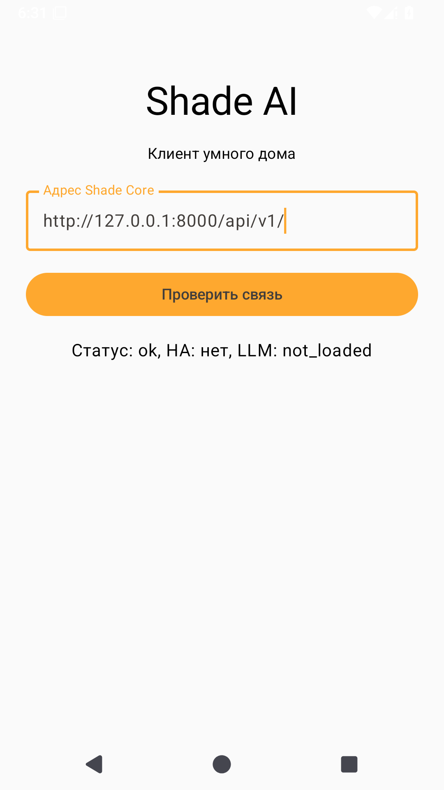

# TASK-03 — Первая проверенная сборка Android

**Статус:** разработка, сборка и проверка в эмуляторе завершены. Осталась приёмка на физическом телефоне: пользователь подтвердил его отсутствие 2026-10-01. Задача остаётся открытой только по этому критерию; повторять выполненные проверки без изменений кода не требуется.

**База:** `5a4ffbe` (TASK-02). Предыдущие TASK-01 (`c49bc06`) и TASK-02 (`5a4ffbe`) отправлены в origin/main. По указанию пользователя коммит и push выполняются после каждой задачи; правило записано в AGENTS.md.

[Карточка](../mvp.md), [контекст](../project-context.md), [сборка и установка](../../android/README.md).

## Изменения

- Добавлен отсутствующий импорт `androidx.compose.runtime.Composable` в MainActivity.
- Manifest подключает Network Security Config. HTTP запрещён по умолчанию и разрешён только для точных адресов `192.168.1.100`, `10.0.2.2`, `127.0.0.1`, `localhost`, `shade.local`; `includeSubdomains=false` задан явно. Штатная проверка HTTPS-сертификатов сохраняется; trust-all/HostnameVerifier не добавлялись. [Документация Android](https://developer.android.com/privacy-and-security/security-config).
- Обновлена инструкция Android: Gradle Wrapper, параметры SDK/JDK, установка APK, локальный HTTP, adb reverse и реальные ограничения текущего скелета.
- SDK и Gradle-кэш установлены внутри игнорируемой android/.gradle/. Системный SDK /opt/android-sdk не менялся. Исходники Core/API, визитка и веб не менялись.

## Окружение и сборка

| Компонент | Версия |
| :--- | :--- |
| JDK | OpenJDK 17.0.19 |
| Gradle Wrapper | 8.10.2 |
| Android Gradle Plugin | 8.7.3 |
| Kotlin / Compose compiler plugin | 2.0.21 |
| KSP | 2.0.21-1.0.28 |
| compileSdk / targetSdk / minSdk | 35 / 35 / 26 |
| SDK Build Tools | 34.0.0 |
| SDK Command-Line Tools | 22.0 |
| SDK Platform Tools | 37.0.1 |
| Android Emulator | 37.1.11 |
| Образ эмулятора | AOSP Android 15 / API 35, revision 2, x86_64 |
| Виртуальное устройство | ShadeTask03API35, профиль Pixel 2, 1536 MB RAM, 2 CPU |

JDK 17 и API 35 соответствуют [таблице совместимости AGP 8.7](https://developer.android.com/build/releases/agp-8-7-0-release-notes). Архив Command-Line Tools скачан с [официальной страницы](https://developer.android.com/studio); SHA-256 совпал с опубликованным: `4e4c464f145a7512b57d088ac6c278c03c9eea610886b35a5e0804e74eedf583`.

Команда из android/:

```bash
env -u ANDROID_SDK_ROOT \
JAVA_HOME=/usr/lib/jvm/java-17-openjdk \
ANDROID_HOME="$PWD/.gradle/sdk" \
ANDROID_USER_HOME="$PWD/.gradle/android-home" \
GRADLE_USER_HOME="$PWD/.gradle/user-home" \
./gradlew :app:assembleDebug :app:lintDebug --no-daemon --max-workers=2
```

**Результат:** BUILD SUCCESSFUL; lint — 0 ошибок, 27 предупреждений (24 об обновлениях Gradle/зависимостей, остальные об устаревшем условии SDK, неиспользуемом ресурсе и monochrome-иконке). Подавления ошибок и lint baseline не добавлялись.

APK: `android/app/build/outputs/apk/debug/app-debug.apk`, **9 727 512 байт**, SHA-256 `9ef636149a604b6406a196f7acbbf39ac5e016a8b4a3ee3d742cbda37babe482`. Проверка apksigner успешна, подпись v2. APK, SDK и ключ debug-подписи не входят в git.

Первый запуск сборки выявил конфликт унаследованного ANDROID_SDK_ROOT=/opt/android-sdk с локальным ANDROID_HOME. Пример выше исключает старую переменную только для команды. Есть предупреждение о SDK XML v4 при инструментах AGP, понимающих v3; сборка и lint завершаются успешно.

## Проверки

- [x] Debug APK собран.
- [x] Android lint проходит без ошибок.
- [x] Подпись APK проверена.
- [x] 29 изолированных тестов Core проходят (1 прежнее предупреждение Starlette).
- [x] Установка, запуск, health и сохранение адреса в AOSP-эмуляторе API 35.
- [x] Запрет HTTP для адреса вне списка разрешений проверен в Android.
- [x] В crash log нет падений приложения.
- [ ] Установка и проверка на физическом телефоне, запись его модели и версии Android.

## Проверка приложения в эмуляторе

Загрузка образа через SDK Manager оборвалась; официальный архив AOSP `x86_64-35_r02.zip` загружен с возобновлением. Размер — 782 404 023 байта, SHA-1 `2d857d170c0d1b827149565da34b3383e5306f7f` совпал с [метаданными SDK-репозитория](https://dl.google.com/android/repository/sys-img/android/sys-img2-3.xml). SDK, образ и AVD находятся в игнорируемой `android/.gradle/`.

Эмулятор работал с KVM без окна, с программной графикой SwiftShader. Свойства устройства: `ro.product.model=Android SDK built for x86_64`, Android `15`, API `35`, ABI `x86_64`. Это виртуальное устройство, не физический Pixel 2.

Сценарий выполнен через adb и UI Automator:

1. Установлен собранный APK, открыта MainActivity. На первом экране виден адрес Core по умолчанию `192.168.1.100`.
2. Запущен отдельный тестовый Core с временной SQLite-БД и тестовым ключом. Рабочий `.env` не использовался; HA намеренно недоступен, LLM не загружена.
3. Через `adb reverse` локальный порт приложения связан с тестовым Core. Введён `http://127.0.0.1:8000/api/v1/`, нажата «Проверить связь»; на экране получено `Статус: ok, HA: нет, LLM: not_loaded`.
4. Выполнена остановка процесса через `am force-stop`, затем повторный запуск. Полный адрес сохранён.
5. Введён `http://127.0.0.2:8000/api/v1/`, отсутствующий в Network Security Config. Android вернул ошибку запрета CLEARTEXT; это проверка политики транспорта на другом loopback-адресе, без обращения к внешнему серверу.
6. Возвращён разрешённый адрес: health снова успешен. Сохранён снимок экрана, crash log проверен. Тестовый Core и эмулятор остановлены.



Это проверка установки и текущего экрана. Она не подтверждает Bearer, отправку уведомлений, фоновые повторы или управление реальным HA-устройством — эти функции относятся к следующим задачам.

## Что требуется для закрытия

На телефоне Android 8.0+ установить APK, открыть экран, указать разрешённый адрес Core, получить health, остановить процесс приложения и открыть снова, проверить сохранённый адрес. Записать модель телефона, Android/API, результат проверки и ошибки, если они есть. Перехват уведомлений и Bearer в этой задаче не требуются — это TASK-09–13.
